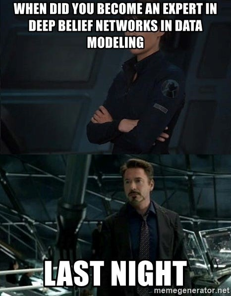
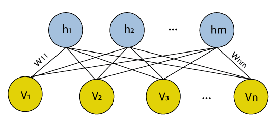

# Deep Belief Network

&nbsp;&nbsp;&nbsp;In the modern landscape of innovation and technology, Artificial Intelligence (AI) invaded most 
transformative and captivating advancements of our life. Starting with predictions on data, 
classifying things into categories, and ending with pictures and music generation, AI is just 
everywhere. One of the most outstanding application of AI is stuff creation (a.k.a. generation). 
Today we will dive in discover one of the generative networks: Deep Belief Network (DBN).

## Introduction

&nbsp;&nbsp;&nbsp;Before we get into more specifics of DBNs, let’s go briefly from 
some general concepts for a better understanding. It is common 
practice to divide Machine Learning models into discriminative 
and generative ones. As it might me concluded from the names, 
discriminative models aim to separate data points into different 
classes, while generative ones – to generate data points. 
Generative models are usually used in unsupervised learning 
problems as they are trained on inputs without their labels. 
DBNs, that will be discussed today, are a type of deep learning 
architecture that combine neural networks and unsupervised 
learning.

    

## What are Deep Belief Networks (DBNs)?

&nbsp;&nbsp;&nbsp;Deep Belief Network is a deep learning architecture, composed of 
layers of Restricted Boltzmann Machines (RBMs), which are trained 
in an unsupervised manner. \
&nbsp; &nbsp; &nbsp;A Restricted Boltzmann Machines is a generative unsupervised 
model used for feature selection and feature reduction technique, 
for dimensionality reduction, classification, regression, and 
other tasks in Machine Learning and Deep Learning. It is 
learning on a probability distribution on a certain dataset 
and uses the learnt distribution to come up with conclusions on 
unexplored data. A typical RBM architecture is represented below 
(where h represents hidden nodes and v – visible nodes).

    

&nbsp; &nbsp; &nbsp;All RBMs that are a part of a Deep Belief Network, are trained in an 
unsupervised manner, one at a time. Thus, the output of one of them 
becomes the input for the next one. The output of the final machine 
is used either in classification or regression tasks, making the 
general DBN architecture look like the one represented below. 
The prior reason that lead to the appearance of DBNs is to create 
unbiased values stored in leaf nodes and to avoid being stuck in 
the local minima. 

    

## DBNs overview

&nbsp;&nbsp;&nbsp;However, besides the Standard DBNs described earlier, there might be 
distinguished several extensions that incorporate different 
structures and components. Therefore, the following are the most 
notorious variations of DBNs:
* Convolutional Deep Belief Networks (ConvDBNs) – in addition to RBMs, 
incorporates convolutional layers;
* Temporal Deep Belief Networks (Temporal DBNs) – extended Standard DBN 
to model sequential and time-series data, incorporating 
recurrent connections or temporal dependencies between layers;
* Variational Deep Belief Networks (VDBNs) – use a probabilistic 
modeling technique, variational interface, in DBMs, making 
multiple layers of hidden units fully connected between 
consecutive layers;
* Stacked Autoencoders -  although not a DBN in the traditional 
sense, when multiple autoencoders are stacked, they form a deep 
architecture that shares a considerate amount of similarities 
with Deep Belief Networks.

## Math base
&nbsp;&nbsp;&nbsp;Despite the diversity of the existing DBNs, it shouldn’t be 
forgotten the fact that all of the share similar “roots”. 
Recall that DBN is a network assembled out of many single 
networks. Except the first and last layers, others play dual 
role serving at the same time as hidden layers that comes before 
and as input for the following one [1] . The joint distribution 
between the observed vector X and the hidden layers hk may be 
expressed using the formula: 

$P(x, h^1, ..., h^l) = (\displaystyle\prod^{l-2}_{k=0} P(h^k|h^{k + 1})P(h^{l - 1}, h^l)$

, where:
* $X$ = $h_0$,
* $P(h^k|h^{k + 1})$ – a conditional distribution for the visible units 
conditioned on the hidden units of the RBM at level k,
* $P(h^{l - 1}, h^l)$ – visible-hidden joint distribution in the top-level RBM.

## DBNs Training

&nbsp;&nbsp;&nbsp;Before training a DBN, it is necessary to remember that every 
individual RBM should be trained. To keep it brief, the 
next steps need to be gone through to train the described model:

1. initiate the units and parameters for this purpose;
2. initialize the number of RBM layers and the size of each of 
them, specifying the parameters (weights and biases) and 
initialization strategy;
3. pre-train RBM layers – using Greedy learning algorithm, that 
implies layer-by-layer approach, determine the relationship 
between variables in one layer and variables in layer above;
4. feature extraction – use hidden activation of the final RBM 
layer as features that can be used for fine-tuned for specific 
tasks;
5. initialize Supervisor Layer – add a supervised layer (usually 
softmax) on top of the last RBM layer;
6. fine-tuning – use labeled data and backpropagation to update 
entire network parameters, adjusting them to minimize the loss, 
optimize the gradient descent, adjusting weights and biases 
based on the gradients of the loss with respect to the parameters 
(you may perform this step in an iterative manner);
7. ~~word-by-word, say loudly and clearly the spell;~~
8. evaluate the trained DBN on a validation set;
9. postprocessing – you might add some steps as tresholding or 
normalization.

    

## Use Cases

&nbsp;&nbsp;&nbsp;On broad terms, Deep Belief Networks can be described as more 
efficient version of feedforward neural network. There follows a 
vast applicability of this type of networks: image recognition, 
recognizing, clustering and generating of images, video sequences 
and motion-caption data. For example, ConvDBNs are good to use 
for tasks that involve grid-like data, such as images, while 
Temporal DBNs are better for speech recognition or natural 
language processing tasks. To sum up, the fields they are widely 
used are:

* Computer Vision – object recognition and classification;
* NLP – sentiment analysis and text classification;
* Speech recognition -  transcribing speech into text;
* Recommendation Systems - giving suggestions based on previous inputs;
* Financial analysis – predicting stock market and how risky some actions are;
* Bioinformatics – predict the interactions between components like proteins, 
find new drugs and predict how genes may express.

## Drawbacks and limits

&nbsp;&nbsp;&nbsp;In spite of a lot advantages DBNs brings, they are still a quite 
early version of a deep neural network and might be not so 
effective as its newest aliases due to a considerable set of 
drawbacks, such as:

* high hardware requirements;
* complex data model that is difficult to train;
* difficult to use by unexperienced people;
* requires of a huge amount of data for a good performance;
* requires classifiers to grasp the output.

## Conclusion

&nbsp;&nbsp;&nbsp;To summarize everything up, Deep Belief Network is an 
early-deep-learning-days architecture, composed of multiple 
Restricted Boltzmann Machines, aimed to perform classification, 
clustering and generation tasks. Due to the presence of RBMs, 
trained once at a time, it uses Greedy Algorithm to train each 
layer until all RBM are trained and the output can be passed to 
supervised learning model. Although it is quite old, it still 
has its fields of applicability where it performs considerable 
better than other known algorithms, that being one of the reasons 
to know about its existence. Not the last, it is just an awesome 
algorithm with a unique architecture that might bring you fun 
while diving in!

    

## References
[1] - ABIRAMI S., CHITRA P., “The Digital Twin Paradigm for 
Smarter Systems and Environments: The Industry Use Cases”, 
Advances in Computers, 2020