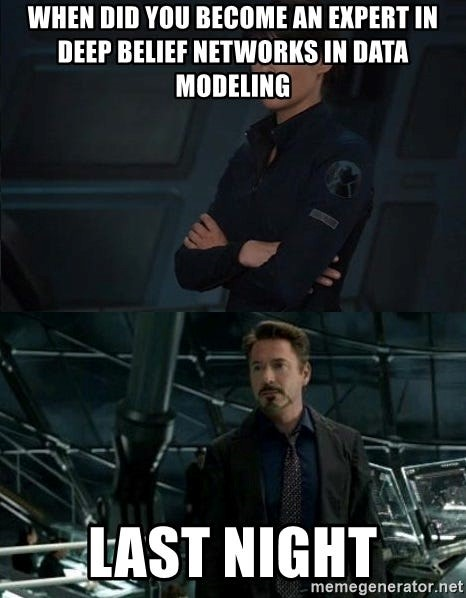
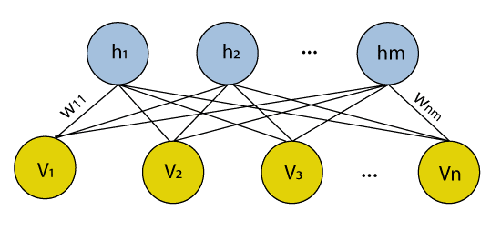
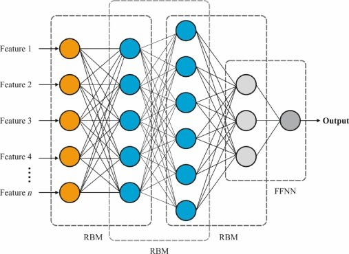
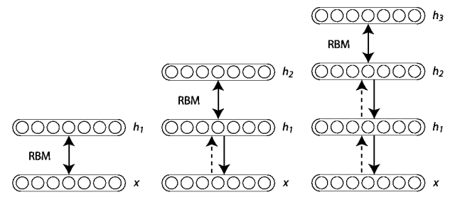
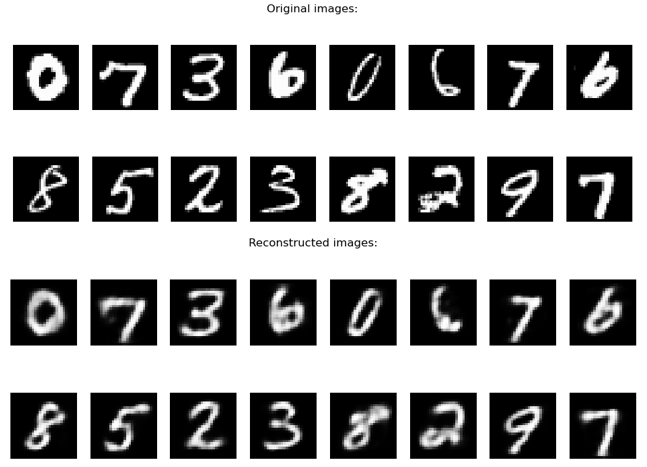
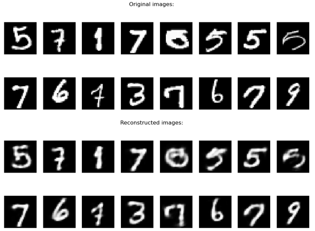
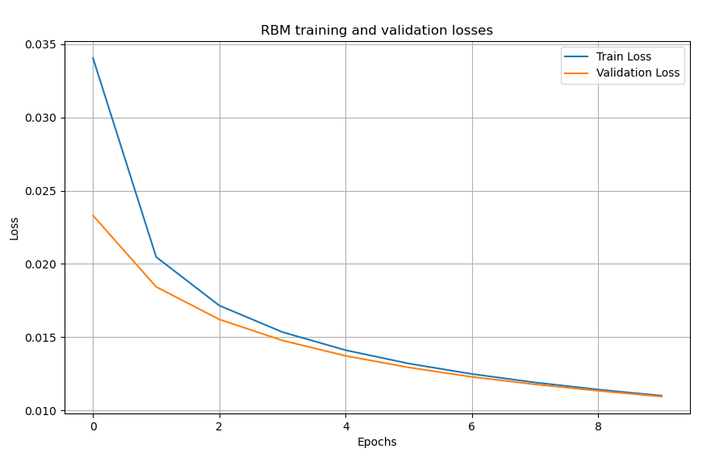
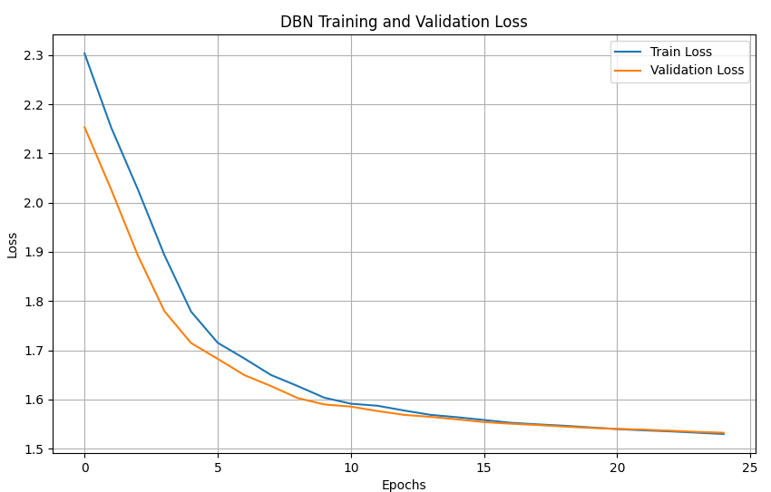

# Deep Belief Network

&nbsp;&nbsp;&nbsp;In the modern era of innovation and technology, Artificial Intelligence (AI) invaded most 
transformative and captivating advancements of our life. Starting with predictions on data, 
classifying things into categories, and ending with pictures and music generation, AI is just 
everywhere. One of the most outstanding application of AI is creation (a.k.a. generation). 
Today we will dive in to discover one of the generative networks: Deep Belief Network (DBN).

## Content:
1. [Introduction](#introduction)
2. [What are Deep Belief Networks (DBNs)?](#what-are-deep-belief-networks-dbns)
3. [DBNs Overview](#dbns-overview)
4. [Math Base](#math-base)
5. [DBNs Training](#dbns-training)
6. [Use Cases](#use-cases)
7. [Drawbacks and limits](#drawbacks-and-limits)
8. [Conclusion](#conclusion)
9. [References](#references)


## Introduction

&nbsp;&nbsp;&nbsp;Before we get into more specifics of DBNs, let’s go briefly from 
some general concepts for a better understanding. It is common 
practice to divide Machine Learning models into discriminative 
and generative ones [1]. As it might be concluded from the names, 
discriminative models aim to separate data points into different 
classes, while generative ones – to generate data points. 
Generative models are usually used in unsupervised learning 
problems as they are trained on inputs without their labels. 
DBNs, that will be discussed today, are a type of deep learning 
architecture that combine neural networks and unsupervised 
learning.

<p align="center">
    
<br><em>Source: https://medium.com/swlh/what-are-rbms-deep-belief-networks-and-why-are-they-important-to-deep-learning-491c7de8937a</em>
</p>

## What are Deep Belief Networks (DBNs)?

&nbsp;&nbsp;&nbsp;Deep Belief Network is a deep learning stochastic architecture, 
composed of layers of Restricted Boltzmann Machines (RBMs), which are trained 
in an unsupervised manner [2]. \
&nbsp; &nbsp; &nbsp;A Restricted Boltzmann Machines is a generative unsupervised 
model used for feature selection and feature reduction technique, 
for dimensionality reduction, classification, regression, and 
other tasks in Machine Learning and Deep Learning [3]. It is 
learning on a probability distribution on a certain dataset 
and uses the learnt distribution to come up with conclusions on 
unexplored data. A typical RBM architecture is represented below 
(where h represents hidden nodes and v – visible nodes).

<p align="center">
    
<br><em>Source: https://www.javatpoint.com/keras-restricted-boltzmann-machine</em>
</p>

&nbsp; &nbsp; &nbsp;All RBMs that are a part of a Deep Belief Network, are trained in an 
unsupervised manner, one at a time [4]. Thus, the output of one of them 
becomes the input for the next one. The output of the final machine 
is used either in classification or regression tasks, making the 
general DBN architecture look like the one represented below. 
The prior reason that lead to the appearance of DBNs is to create 
unbiased values stored in leaf nodes and to avoid being stuck in 
the local minima [5]. 

<p align="center">
    
<br><em>Source: https://www.sciencedirect.com/topics/engineering/deep-belief-network</em>
</p>

## DBNs Overview

&nbsp;&nbsp;&nbsp;However, besides the Standard DBNs described earlier, there might be 
distinguished several extensions that incorporate different 
structures and components. Therefore, the following are the most 
notorious variations of DBNs:
* Convolutional Deep Belief Networks (ConvDBNs) – in addition to RBMs, 
incorporates convolutional layers [6];
* Temporal Deep Belief Networks (Temporal DBNs) – extended Standard DBN 
to model sequential and time-series data, incorporating 
recurrent connections or temporal dependencies between layers [7];
* Variational Deep Belief Networks (VDBNs) – use a probabilistic 
modeling technique, variational interface, in DBMs, making 
multiple layers of hidden units fully connected between 
consecutive layers;
* Stacked Autoencoders -  although not a DBN in the traditional 
sense, when multiple autoencoders are stacked, they form a deep 
architecture that shares a considerate amount of similarities 
with Deep Belief Networks.

## Math Base
&nbsp;&nbsp;&nbsp;Despite the diversity of the existing DBNs, it shouldn’t be 
forgotten the fact that all of the share similar “roots”. 
Recall that DBN is a network assembled out of many single 
networks. Except the first and last layers, others play dual 
role serving at the same time as hidden layers that comes before 
and as input for the following one [8] . The joint distribution 
between the observed vector X and the hidden layers hk may be 
expressed using the formula: 

<p align="center">
$P(x, h^1, ..., h^l) = (\displaystyle\prod^{l-2}_{k=0} P(h^k|h^{k + 1})P(h^{l - 1}, h^l))$
</p>

, where:
* $X$ = $h_0$,
* $P(h^k|h^{k + 1})$ – a conditional distribution for the visible units 
conditioned on the hidden units of the RBM at level k,
* $P(h^{l - 1}, h^l)$ – visible-hidden joint distribution in the top-level RBM.

## DBNs Training

&nbsp;&nbsp;&nbsp;Before training a DBN, it is necessary to remember that it is composed 
of multiple Restricted Boltzmann Machines that should be individually trained.
We will analyze a typical structured DBN training using an example of a classification 
task of handwritten digits. The data will be obtained from the MNIST dataset.

**Step 1. Initiate the units and parameters of the Restricted Boltzmann Machine.**

To implement an RBM, we create a corresponding class, with the `__init__` function 
containing the number of visible and hidden layers, the visible and hidden biases, 
and the weight matrix initialization. The Xavier is used to ensure the weights are 
initialized properly, which leads to an improved training process. 

```python
class RBM(nn.Module):
    def __init__(self, visible_units, hidden_units):
        super(RBM, self).__init__()
        self.visible_units = visible_units  # number of visible units
        self.hidden_units = hidden_units  # number of hidden units
        self.weights = nn.Parameter(torch.empty(hidden_units, visible_units))  # weight matrix
        nn.init.xavier_uniform_(self.weights)  # weights initialization
        self.visible_bias = nn.Parameter(torch.zeros(visible_units))  # bias for the visible units
        self.hidden_bias = nn.Parameter(torch.zeros(hidden_units))  # bias for the hidden units
```

**Step 2. Initialize the number of RBM layers and the size of each of 
them, specifying the parameters (weights and biases) and 
initialization strategy.**

The second step focuses on deciding upon the number of RBM layers in the final model, 
specifying the size of each visible and hidden layer, and appropriately initializing 
the RBM parameters. 

For the digit classification, we will use a simple model with 784 visible units (as 
the images in MNIST dataset are 28x28 pixels) and one hidden layer of 128 units.

```python
input_dim = 784
hidden_layers = [128]

rbm_layers = []
current_input = train_inputs
current_val_input = val_inputs
for h_units in hidden_layers:
    rbm = RBM(input_dim, h_units).to(device)
    rbm_layers.append(rbm)  # store the RBM
    input_dim = h_units  # update the input size for the next RBM
```

<p align="center">
    
<br><em>Source: https://icecreamlabs.medium.com/deep-belief-networks-all-you-need-to-know-68aa9a71cc53</em>
</p>

**Step 3. Pre-train RBM layers – using Greedy learning algorithm, that 
implies layer-by-layer approach, determine the relationship 
between variables in one layer and variables in layer above.**

During this step, the RBMs are pre-trained, one by one. Each RBM, trained layer by 
layer, is stored in a list for stacking later.

```python
input_dim = 784
hidden_layers = [128]


rbm_layers = []
current_input = train_inputs
current_val_input = val_inputs
for h_units in hidden_layers:
    rbm = RBM(input_dim, h_units).to(device)
    rbm_train_loss, rbm_val_loss = rbm.pretrain(current_input, current_val_input, rbm_batch_size=batch_size)  # train RBM
    rbm_layers.append(rbm)  # store the RBM
    input_dim = h_units  # update the input size for the next RBM
```

The images were reconstructed every five epochs to monitor the process of training 
the RBM and how well the model learns new features. Below can be observed the results 
after five epochs of training.

<p align="center">
    
<br><em>The Original and Recreated images after 5 training epochs</em>
</p>

It can be noticed that while it keeps the main characteristics of the original images, 
the recreated ones are still blurred, especially compared to the results obtained after 
10 epochs of training. It can also be noticed that more training epochs lead to more 
defined boundaries of digits, and overall better quality of reconstructions.

<p align="center">
    
<br><em>The Original and Recreated images after 10 training epochs</em>
</p>

The improvement in RBM performance is also proven by the train and validation loss 
dynamic, which shows a decreasing trend, close to 0 in the end.

<p align="center">
    
</p>

**Step 4. Feature extraction – use hidden activation of the final RBM 
layer as features that can be used for fine-tuned for specific 
tasks.**

This step focuses on the features (hidden activations) extraction from the provided input. 
After extracting them, the features will be used as input for the next RBMs. 


```python
input_dim = 784
hidden_layers = [128]

rbm_layers = []
current_input = train_inputs
current_val_input = val_inputs
for h_units in hidden_layers:
    rbm = RBM(input_dim, h_units).to(device)
    rbm_train_loss, rbm_val_loss = rbm.pretrain(current_input, current_val_input, rbm_batch_size=batch_size)  # train RBM
    current_input = rbm.extract_features(current_input)  # extracting features
    current_val_input = rbm.extract_features(current_val_input)
    rbm_layers.append(rbm)  # store the RBM
    input_dim = h_units  # update the input size for the next RBM
```

**Step 5. Initialize Supervisor Layer – add a supervised layer (usually 
softmax) on top of the last RBM layer.**

For the next step, we initialize the DBN class, specifying what classifier we will be 
using. As we are dealing with a classification problem, we will be using Softmax as the 
last activation layer.

```python
class DBN(nn.Module):
    def __init__(self, rbm_layers, output_classes):
        super(DBN, self).__init__()
        self.rbms = nn.ModuleList(rbm_layers)
        self.classifier = nn.Sequential(
            nn.Linear(rbm_layers[-1].hidden_units, output_classes),  # fully connected layer
            nn.Softmax(dim=1),  # Softmax for classification
        )

    def forward(self, x):
        for rbm in self.rbms:
            x = torch.sigmoid(torch.matmul(x, rbm.weights.t()) + rbm.hidden_bias)
        return self.classifier(x)
```

**Step 6. ~~Word-by-word, say loudly and clearly the spell.~~ Train the model.**

During this step, the RBMs are used only for feature extraction, while the supervised 
layer is trained on labelled data to classify the digits accordingly.

```python
def train_dbn(dbn, dbn_train_data, dbn_train_labels, dbn_val_data, dbn_val_labels, epochs=25, lr=0.05):
    criterion = nn.CrossEntropyLoss()
    train_losses, val_losses = [], []

    for epoch in range(epochs):
        dbn.train()
        outputs = dbn(dbn_train_data)
        train_loss = criterion(outputs, dbn_train_labels)
        train_loss.backward()
        train_losses.append(train_loss.item())

        dbn.eval()
        with torch.no_grad():
            val_outputs = dbn(dbn_val_data)
            val_loss = criterion(val_outputs, dbn_val_labels)
            val_losses.append(val_loss.item())

        print(f"Epoch {epoch + 1}/{epochs}, Train Loss: {train_loss.item():.4f}, Val Loss: {val_loss:.4f}")

    return train_losses, val_losses
```

The model was trained for 25 epochs, during which the loss was reduced considerably, 
as it can be observed from the diagram provided below.

<p align="center">
    
</p>

**Step 7. Fine-tune the model.**

Use labeled data and backpropagation to update entire network parameters, 
adjusting them to minimize the loss, optimize the gradient descent, adjusting weights 
and biases based on the gradients of the loss with respect to the parameters, as well
as the number of epochs, hidden layers, or the batch size 
(you may perform this step in an iterative manner).

```python
def train_dbn(dbn, dbn_train_data, dbn_train_labels, dbn_val_data, dbn_val_labels, epochs=25, lr=0.05):
    criterion = nn.CrossEntropyLoss()
    optimizer = optim.Adam(dbn.parameters(), lr=lr)
    train_losses, val_losses = [], []

    for epoch in range(epochs):
        dbn.train()
        optimizer.zero_grad()
        outputs = dbn(dbn_train_data)
        train_loss = criterion(outputs, dbn_train_labels)
        train_loss.backward()
        optimizer.step()
        train_losses.append(train_loss.item())

        dbn.eval()
        with torch.no_grad():
            val_outputs = dbn(dbn_val_data)
            val_loss = criterion(val_outputs, dbn_val_labels)
            val_losses.append(val_loss.item())

        print(f"Epoch {epoch + 1}/{epochs}, Train Loss: {train_loss.item():.4f}, Val Loss: {val_loss:.4f}")

    return train_losses, val_losses
```

**Step 8. Evaluate the trained DBN on a test set.**

This step is intended to show the performance of the model, evaluating it against a test 
set or, in other words, unseen data. Using the provided source code, it was possible to 
achieve an accuracy of 0.94, which is a pretty solid result.

```python
def evaluate(dbn_model, data, labels):
    with torch.no_grad():
        outputs = dbn_model(data)
        _, predicted = torch.max(outputs, 1)
        accuracy = (predicted == labels).sum().item() / len(labels)

    print(f"Accuracy: {accuracy:.2f}")
```

**Step 9. Postprocessing.** 

After performing everything mentioned above you might want to improve the performance
of the model by adding some additional steps as thresholding or normalization.

```python
# normalization
transform = transforms.Compose([
    transforms.ToTensor(),
    transforms.Normalize((0.5,), (0.5,)),
    transforms.Lambda(lambda x: (x + 1) / 2)
])
```

## Use Cases

&nbsp;&nbsp;&nbsp;On broad terms, Deep Belief Networks can be described as more 
efficient version of feedforward neural network. There follows a 
vast applicability of this type of networks: image recognition, 
recognizing, clustering and generating of images, video sequences 
and motion-caption data. For example, ConvDBNs are good to use 
for tasks that involve grid-like data, such as images, while 
Temporal DBNs are better for speech recognition or natural 
language processing tasks. To sum up, the fields they are widely 
used are:

* Computer Vision – object recognition and classification [6];
* NLP – sentiment analysis and text classification;
* Speech recognition -  transcribing speech into text;
* Recommendation Systems - giving suggestions based on previous inputs;
* Financial analysis – predicting stock market and how risky some actions are;
* Bioinformatics – predict the interactions between components like proteins, 
find new drugs and predict how genes may express.

## Drawbacks and limits

&nbsp;&nbsp;&nbsp;In spite of a lot advantages DBNs brings, they are still a quite 
early version of a deep neural network and might be not so 
effective as its newest aliases due to a considerable set of 
drawbacks, such as:

* high hardware requirements;
* complex data model that is difficult to train;
* difficult to use by unexperienced people;
* requires of a huge amount of data for a good performance;
* requires classifiers to grasp the output.

## Conclusion

&nbsp;&nbsp;&nbsp;To summarize everything up, Deep Belief Network is an 
early-deep-learning-days architecture, composed of multiple 
Restricted Boltzmann Machines, aimed to perform classification, 
clustering and generation tasks. Due to the presence of RBMs, 
trained once at a time, it uses Greedy Algorithm to train each 
layer until all RBM are trained and the output can be passed to 
supervised learning model. Although it is quite old, it still 
has its fields of applicability where it performs considerable 
better than other known algorithms, that being one of the reasons 
to know about its existence. Not the last, it is just an awesome 
algorithm with a unique architecture that might bring you fun 
while diving in!

<p align="center">
    
<br><em>Source: https://www.123rf.com/photo_166564781_that-s-all-folks-vintage-movie-ending-screen-background-the-end-vector-illustration-.html</em>
</p>


## References
[1] - E. ARGOUARC'H, F. DESBOUVRIES, E. BARAT, E. KAWASAKI, 
_Generative vs. Discriminative modeling under the lens of uncertainty quantification_,
doi: arXiv.2406.09172. Access link: https://arxiv.org/pdf/2406.09172 \
[2] - M. ZAMBRA, A. TESTOLIN, M. ZoORZI, _A developmental approach for training deep 
belief networks_, doi: arXiv.2207.05473. Access link: https://arxiv.org/pdf/2207.05473 \
[3] - MEDIUM, _What Are RBMs, Deep Belief Networks and Why Are They Important to Deep Learning?_.
Article. [quoted 29.07.2023]. Access link:  https://medium.com/swlh/what-are-rbms-deep-belief-networks-and-why-are-they-important-to-deep-learning-491c7de8937a \
[4] - JAVATPOINT, _Restricted Boltzmann Machine_. Article. [quoted 30.07.2023]. Access link: 
https://www.javatpoint.com/keras-restricted-boltzmann-machine \
[5] - AL-JABERY K. K., WUNSCH D. C., _Selected approaches to supervised learning_, 
Computational Learning Approaches to Data Analytics in Biomedical Applications, 2020 \
[6] - H. LEE, R. GROSSE, Ra. RANGANATH, A. Y. NG, 
_Convolutional Deep Belief Networks for Scalable Unsupervised Learning of Hierarchical Representations_,
doi: 10.1145/1553374.1553453, Access link: https://ai.stanford.edu/~ang/papers/icml09-ConvolutionalDeepBeliefNetworks.pdf? \
[7] - F.Y ZHOU, J. Q YIN, Y. Yang, H.T. ZHANG, 
_Online recognition of human actions based on temporal deep belief neural network_,
doi: 10.16383/j.aas.2016.c150629. 
Access link: https://www.researchgate.net/publication/306168057_Online_recognition_of_human_actions_based_on_temporal_deep_belief_neural_network \
[8] - ABIRAMI S., CHITRA P., _The Digital Twin Paradigm for 
Smarter Systems and Environments: The Industry Use Cases_, 
Advances in Computers, 2020