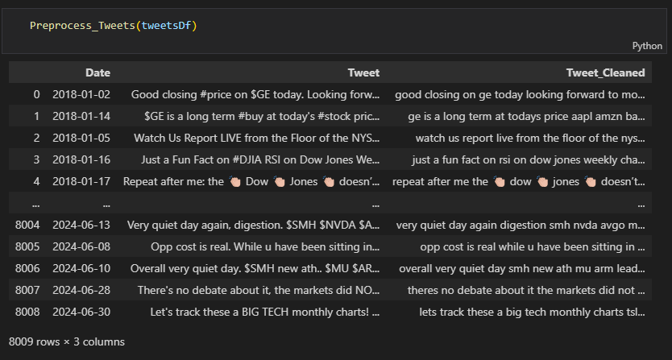
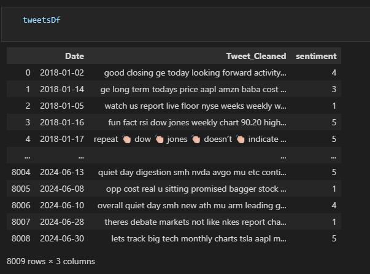
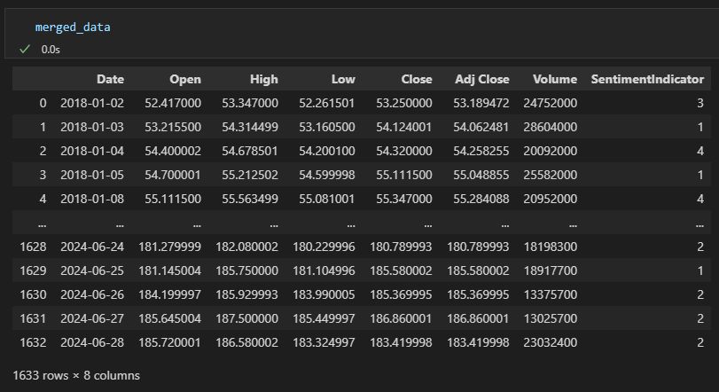
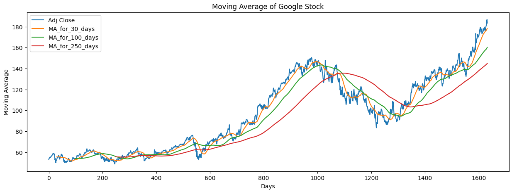
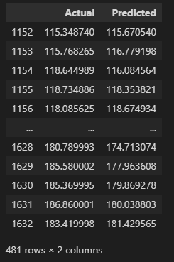
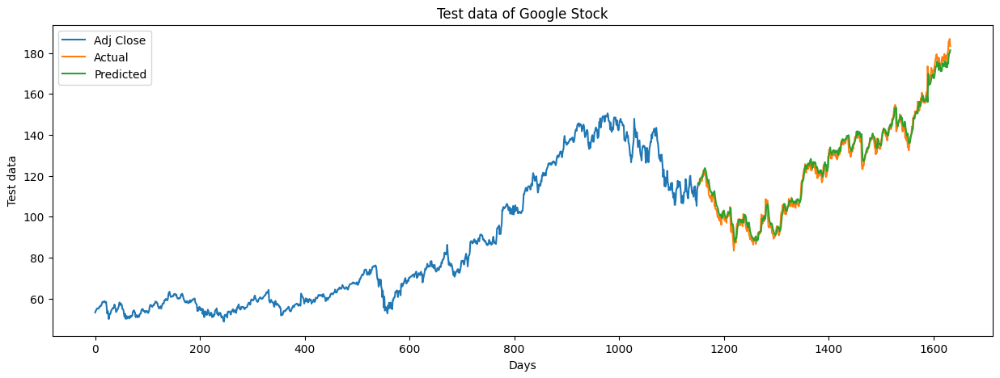

# Harnessing Transformers and LSTM for Financial Market Trend Prediction

<p style="font-size: 20px;">This article explores the application of transformers and LSTM in predicting financial market trends, with a particular focus on the advantages of transformers in this domain.</p>

<div style="text-align: center;">
    
</div>

<p></p>

<div style="font-size: 18px;">
    In the fast-paced world of financial markets, predicting trends has always been a challenging yet crucial task for investors, traders, and financial institutions. As technology advances, machine learning techniques have emerged as powerful tools for analyzing complex market dynamics and forecasting future movements. Among these techniques, transformers and Long Short-Term Memory (LSTM) networks have shown remarkable potential in capturing intricate patterns and relationships within financial data.
</div>

<p></p>

<p style="font-size: 18px; font-weight: bold;">What are Transformers?</p>

<p style="font-size: 18px;">Transformers are deep learning models that use self-attention mechanisms to process and understand relationships within input data. Unlike traditional sequential models such as recurrent neural networks (RNNs), transformers can process entire sequences simultaneously, making them highly parallelizable and efficient.</p>

<p style="font-size: 18px; font-weight: bold;">Key Components of Transformers</p>

<ol style="font-size: 18px;">
    <li><b>Self-Attention Mechanism:</b> The heart of the transformer architecture is the self-attention mechanism. It allows the model to weigh the importance of different parts of the input when processing each element.</li>
    <li><b>Multi-Head Attention:</b> This component extends the self-attention mechanism by applying it multiple times in parallel.</li>
    <li><b>Feed-Forward Networks:</b> These are fully connected neural networks applied to each position separately and identically. They add non-linearity to the model, allowing it to learn complex functions.</li>
    <li><b>Positional Encoding:</b> Since transformers process input in parallel, they need a way to understand the order of the sequence. Positional encodings add information about the position of each element in the input sequence.</li>
</ol>

<p style="font-size: 18px;">One of the most popular transformers for sentiment analysis is BERT (Bidirectional Encoder Representations from Transformers). Developed by Google, BERT is designed to understand the context of a word in a sentence by looking at the words that come before and after it. This bidirectional approach allows BERT to capture the nuanced meaning of words, making it highly effective for tasks like sentiment analysis. In our project, we used BERT to analyze the sentiment of the market for each day based on tweets.</p>

### Data Preprocessing
<p style="font-size: 18px;">Preprocessing is a crucial step in Natural Language Processing (NLP) to prepare raw text data for analysis or model training.</p>

<ol style="font-size: 18px;">
    <li><b>Text Cleaning</b>
        <ul>
            <li>Convert text to lowercase.</li>
            <li>Remove numbers, punctuation, special characters, and HTML tags.</li>
        </ul>
    </li>
    <li><b>Tokenization</b>
        <ul>
            <li>Split cleaned text into tokens (words).</li>
        </ul>
    </li>
    <li><b>Stopword Removal</b>
        <ul>
            <li>Remove common words (stopwords) like “the,” “and,” “is,”</li>
            <li>Helps reduce noise and improve model performance</li>
        </ul>
    </li>
    <li><b>Stemming/Lemmatization</b>
        <ul>
            <li>Stemming reduces words to their root form (e.g., “running” to “run”)</li>
            <li>Lemmatization converts words to their base form (e.g., “better” to “good”)</li>
            <li>Both enhance feature extraction</li>
        </ul>
    </li>
</ol>

```python 
def Preprocess_Tweets(data):
		
	data['Tweet_Cleaned'] = data['Tweet'].str.lower()

	## FIX HYPERLINKS
	data['Tweet_Cleaned'] = data['Tweet_Cleaned'].replace(r'https?:\/\/.*[\r\n]*', ' ',regex=True)
	data['Tweet_Cleaned'] = data['Tweet_Cleaned'].replace(r'www.*[\r\n]*', ' ',regex=True)
	data['Tweet_Cleaned'] = data['Tweet_Cleaned'].str.replace('https', '', regex=False)


	## FIX INDIVIDUAL SYMBOLS 
	data['Tweet_Cleaned'] = data['Tweet_Cleaned'].str.replace(': ', ' ', regex=False)
	data['Tweet_Cleaned'] = data['Tweet_Cleaned'].str.replace(', ', ' ', regex=False)
	data['Tweet_Cleaned'] = data['Tweet_Cleaned'].str.replace('. ', ' ', regex=False)
	data['Tweet_Cleaned'] = data['Tweet_Cleaned'].str.replace('[;\n~]', ' ', regex=True)


    ## FIX < > SYMBOLS
	data['Tweet_Cleaned'] = data['Tweet_Cleaned'].str.replace('[<]+ ', ' ', regex=True)
	data['Tweet_Cleaned'] = data['Tweet_Cleaned'].str.replace('<', ' less than ', regex=False)
	data['Tweet_Cleaned'] = data['Tweet_Cleaned'].str.replace(' [>]+', ' ', regex=True)
	data['Tweet_Cleaned'] = data['Tweet_Cleaned'].str.replace('>', ' greater than ', regex=False)
	data['Tweet_Cleaned'] = data['Tweet_Cleaned'].str.replace('\u2066', ' ', regex=False)
	data['Tweet_Cleaned'] = data['Tweet_Cleaned'].str.replace('\u2069', ' ', regex=False)
```

<p style="font-size: 18px;">Before and After Preprocessing</p>
<div style="text-align: center;">
    
</div>

### Get Sentiment rating from pre-trained model
<p style="font-size: 18px;">In this part, the code initializes a pre-trained BERT tokenizer and model from Hugging Face for multilingual sentiment analysis, allowing the conversion of text into tokens and the classification of sentiment.</p>

```python
tokenizer = AutoTokenizer.from_pretrained('nlptown/bert-base-multilingual-uncased-sentiment')

model = AutoModelForSequenceClassification.from_pretrained('nlptown/bert-base-multilingual-uncased-sentiment')
```

<p style="font-size: 18px;">Function to analyze each tweet and predict sentiment score</p>

```python
def sentiment_score(tweet):
  tokens = tokenizer.encode(tweet, return_tensors='pt')
  result = model(tokens)
  return int(torch.argmax(result.logits))+1

tweetsDf['sentiment'] = tweetsDf['Tweet_Cleaned'].apply(lambda x: sentiment_score(x[:512]))
```

<p style="font-size: 18px;">After Sentiment Tweet analysis</p>
<div style="text-align: center;">
    
</div>


### LSTM (Long Short-Term Memory)
<p style="font-size: 18px;">Long Short-Term Memory (LSTM) networks are a type of recurrent neural network (RNN) specifically designed to handle long-term dependencies in sequential data. Unlike traditional RNNs, LSTMs can effectively retain and learn from past data over extended sequences, making them particularly useful for time series prediction tasks, such as financial data analysis.</p>

<p style="font-size: 18px; font-weight: bold;">How LSTM Works</p>
<p style="font-size: 18px;">LSTMs consist of memory cells and three types of gates (input, forget, and output gates) that regulate the flow of information:</p>

<ul style="font-size: 18px;">
    <li><b>Memory Cells:</b> These cells store information over long periods, enabling the network to remember important patterns and trends.</li>
    <li><b>Input Gate:</b> Controls the extent to which new information flows into the memory cell.</li>
    <li><b>Forget Gate:</b> Determines how much of the past information should be forgotten or retained.</li>
    <li><b>Output Gate:</b> Regulates the output of the memory cell to the next layer.</li>
</ul>

<p style="font-size: 18px;">LSTM networks offer significant advantages for financial data analysis due to their ability to capture long-term dependencies, handle non-stationary and noisy data, model complex patterns, and process sequential information. These capabilities make LSTMs a powerful tool for predicting financial market trends and making informed investment decisions.</p>

### Combine Finance data with Sentiment Indicator

<p style="font-size: 18px;">We use the <code>yfinance</code> library to fetch historical stock price data. The sentiment data is concatenated with the financial data based on the date.</p>

```python
import yfinance as yf
from datetime import datetime

end = datetime(2024, 7, 1)
start = datetime(2018, 1, 1)

stock = "GOOG" # Google stock
google_stock = yf.download(stock, start, end)
```

<div style="text-align: center;">
    
    <p>Merged financial and sentiment data</p>
</div>

<div style="text-align: center;">
    
</div>

<p></p>

<p style="font-size: 18px;">A 30-day moving average technique is applied to smooth out the data and identify trends, helping us determine the best predictor variables. The combined dataset is scaled using the MinMaxScaler to normalize the feature values. This scaling helps in making our predictions faster and more accurate by ensuring that all features contribute equally to the model's learning process.</p>

<p style="font-size: 18px; font-weight: bold;">Training LSTM Model</p>

<p style="font-size: 18px;">Define an LSTM neural network model to predict stock prices. It consists of two LSTM layers followed by two Dense layers, compiled with the Adam optimizer and mean squared error loss, and is trained on the dataset for 5 epochs. After training, the model generates predictions on the test data.</p>

```python
model = Sequential()
model.add(LSTM(128, input_shape=(x_train.shape[1], x_train.shape[2]), return_sequences=True))
model.add(LSTM(64, return_sequences=False))
model.add(Dense(25))
model.add(Dense(1))

model.compile(optimizer='adam', loss='mean_squared_error')

model.fit(x_train, y_train, batch_size=1, epochs=5)

predictions = model.predict(x_test)
```

<p style="font-size: 18px;">The comparison between the “Actual” and “Predicted” values suggests that they are quite similar, indicating good alignment between model predictions and real-world data. </p>

<div style="text-align: center;">
    
    <p>Prediction Results</p>
</div>

<p style="font-size: 18px;">The combined BERT-LSTM model shows promising results in predicting stock prices. By incorporating sentiment analysis, the model captures the impact of market sentiment on stock prices, leading to improved prediction accuracy. The performance metrics indicate that the BERT-LSTM model outperforms traditional models that do not consider sentiment indicators.</p>

<div style="text-align: center;">
    
    <p>Plot of actual and predicted price</p>
</div>

### Conclusion

<p style="font-size: 18px;">This article highlights the potential of transformers, particularly BERT, in enhancing stock price prediction through sentiment analysis. By combining the strengths of BERT and LSTM, and integrating techniques like moving averages and data scaling, we can develop a robust model that captures both market sentiment and historical price patterns.</p>

### References
<p style="font-size: 16px;">[1] <a href="https://web.stanford.edu/class/archive/cs/cs224n/cs224n.1234/final-reports/final-report-170049613.pdf">https://web.stanford.edu/class/archive/cs/cs224n/cs224n.1234/final-reports/final-report-170049613.pdf</a></p>
<p style="font-size: 16px;">[2] <a href="https://cs229.stanford.edu/proj2011/GoelMittal-StockMarketPredictionUsingTwitterSentimentAnalysis.pdf">https://cs229.stanford.edu/proj2011/GoelMittal-StockMarketPredictionUsingTwitterSentimentAnalysis.pdf</a></p>
<p style="font-size: 16px;">[3] <a href="https://huggingface.co/nlptown/bert-base-multilingual-uncased-sentiment">https://huggingface.co/nlptown/bert-base-multilingual-uncased-sentiment</a></p>
<p style="font-size: 16px;">[4] <a href="https://finance.yahoo.com/">https://finance.yahoo.com/</a></p>
<p style="font-size: 16px;">[5] <a href="https://medium.com/@iamshowkath/data-pre-processing-techniques-for-machine-learning-models-a-guide-for-nlp-practitioners-b89b80282968">Data Pre-processing Techniques for Machine Learning Models</a></p>

<div style="height: 50px"></div>

<p style="font-size: 16px;">Written by Saveliev Maxim</p>
<p style="font-size: 16px;">LinkedIn: <a href="https://www.linkedin.com/in/maxim-saveliev-796358281">www.linkedin.com/in/maxim-saveliev-796358281</a></p>
<p style="font-size: 16px;">GitHub: <a href="https://github.com/MaximSaveliev">https://github.com/MaximSaveliev</a></p>


