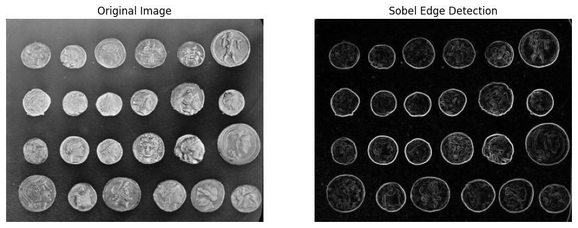

# Image Segmentation (Part 1)


_Source: [https://www.telusinternational.com/insights/ai-data/article/guide-to-image-segmentation](https://www.telusinternational.com/insights/ai-data/article/guide-to-image-segmentation)_

## Table of contents

1. [Introduction](#intro)
2. [Understanding Human Segmentation](#human_seg)
3. [Image Segmentation Types](#types)
4. [Image Segmentation Techniques](#techniques)
5. [Traditional Techniques](#traditional)
   1. [Thresholding](#thresholding)
   2. [Edge-based Segmentation](#edge_based)
   3. [Region-based Segmentation](#region_based)
   4. [Clustering](#clustering)
6. [Conclusion](#conclusion)
7. [References](#references)

## Introduction <a id="intro"></a>

Image segmentation is a fundamental problem in the field of computer vision, aiming to divide a picture into coherent and meaningful regions. This critical task plays a crucial role in numerous applications, such as object recognition, image editing, and scene understanding. The process involves identifying and grouping pixels that share common characteristics, leading to a more structured and interpretable representation of visual information.

In this article, we will explore different image segmentation techniques, focusing on traditional methods. The approaches covered include thresholding, edge-based segmentation, region-based segmentation, and clustering. To implement and demonstrate these techniques, we will utilize Python along with popular libraries like OpenCV and scikit-image, providing efficient tools for image processing and analysis. Thus, first ensure you have the necessary libraries installed by typing the following in the terminal:

```sh
pip install opencv-python scikit-image scipy numpy matplotlib
```

## Understanding Human Segmentation <a id="human_seg"></a>

Before delving into computer-based techniques for image segmentation, it is essential to acknowledge that the human approach to segmentation is subjective and intuitive, guided by Gestalt principles such as similarity, proximity, closure, and continuity (Figure 1). This subjectivity makes segmentation an ill-defined problem, as it heavily relies on the project's goals and human perception, which can be influenced by past experiences and biases.


_Figure 1. Gestalt Principles. Source: [https://uxhints.com/visual-ui-design/gestalt-principles/](https://uxhints.com/visual-ui-design/gestalt-principles/)_

Translating these intuitive human intuitions into algorithms is indeed challenging. Currently, there are two main approaches to image segmentation:

1.  Bottom-Up Segmentation: This data-driven approach analyzes low-level features such as color, texture, and edges to group similar regions based on inherent properties within the image. It avoids preconceived notions and specific goals, focusing on objective boundaries.

2.  Top-Down Segmentation: This approach utilizes high-level knowledge and context, guided by human cognitive understanding, expectations, and task-specific goals. It enables more meaningful and goal-oriented segmentation but may be influenced by subjective factors.

Automated algorithms often employ bottom-up methods to find objective boundaries through mathematical techniques. However, effectively mimicking human segmentation requires AI models to combine both approaches, fostering flexibility for diverse interpretations and addressing potential biases.

## Image Segmentation Types <a id="types"></a>

Having recognized the intuitive nature of segmentation even for humans, let's explore how artificial intelligence approaches this essential problem. Before doing so, it is necessary to define objects and backgrounds. Objects represent identifiable entities within an image, each distinguished by unique IDs. On the other hand, the background encompasses elements like the sky, water bodies, or other uncountable components.

Image segmentation tasks can be classified based on the amount and type of information they convey. Below is an overview of these approaches, followed by visual outputs for each segmentation type.

| Type                  | Goal                                         | Input                                                  | Output                                                                                                                           |
| --------------------- | -------------------------------------------- | ------------------------------------------------------ | -------------------------------------------------------------------------------------------------------------------------------- |
| Instance Segmentation | Find every distinct object of target classes | An image and some instance target classes              | A bounding box and a segmentation mask for each instance of target classes                                                       |
| Semantic Segmentation | Classify every pixel on an image             | An image and some semantic target classes              | Pixel-perfect segmentation map of the whole image                                                                                |
| Panoptic Segmentation | Combine Instance and Semantic Segmentation   | An image and some instance and semantic target classes | Pixel-perfect segmentation map of the whole image AND a bounding box and a segmentation mask for each instance of target classes |

|               |  |
| :--------------------------------------------------: | :--------------------------------------------------: |
|                   _Original Image_                   |               _Semantic Segmentation_                |
|  |  |
|               _Instance Segmentation_                |               _Panoptic Segmentation_                |

Each segmentation type possesses distinct traits and finds relevance in diverse applications. In the subsequent section, we will explore some common image segmentation techniques with examples, showcasing their respective strengths and weaknesses.

## Image Segmentation Techniques <a id="techniques"></a>

Over the years, the field of image segmentation has witnessed the development of various techniques, broadly classified into two main categories: traditional methods and deep learning approaches, as depicted in Figure 3. While both categories offer valuable insights, this article will focus exclusively on traditional techniques. The discussion of deep learning methods will follow in Part 2.


_Figure 3. Image Segmentation Techniques_

### Traditional Techniques <a id="traditional"></a>

In the realm of image segmentation, traditional approaches rely on handcrafted features and classical computer vision algorithms. These methods use mathematical and statistical operations to identify distinct regions within an image. In this section, we will explore four fundamental traditional image segmentation techniques: thresholding, edge-based segmentation, region-based segmentation, and clustering.

#### 1. Thresholding <a id="thresholding"></a>

The most straightforward approach to image segmentation is known as the thresholding method. It relies on changes in the grayscale values of an image. It is employed for extracting foreground objects from the background by selecting a specific threshold value.

In the context of [low-noise](https://en.wikipedia.org/wiki/Image_noise) images, a constant threshold value (T) can be utilized. However, dynamic thresholds may be required in certain scenarios. In this section, we will explore the implementation of thresholding using OpenCV, illustrating its practical application with an example image (Figure 4).


_Figure 4. Source: [Unsplash](https://unsplash.com/photos/f8PQ7fZVHNs?utm_source=unsplash&utm_medium=referral&utm_content=creditCopyText)_

Let's begin by importing the necessary libraries and loading the image:

```python
import cv2
from skimage import exposure, filters, color
import matplotlib.pyplot as plt
import numpy as np
```

Next, we will read the image, convert it to grayscale, and display it:

```python
# Read image
img = cv2.imread('images/cat_snow.jpg')
# Convert to RGB
img = cv2.cvtColor(img, cv2.COLOR_BGR2RGB)
# Convert to grayscale
img = cv2.cvtColor(img, cv2.COLOR_RGB2GRAY)

# Display image
plt.imshow(cv2.cvtColor(img, cv2.COLOR_BGR2RGB))
plt.axis('off')
plt.show()
```


##### 1.1. Simple Thresholding

The process for simple thresholding can be mathematically represented as follows:

```vb
If pixel_value > threshold_value:
    set pixel to foreground_value (e.g., 255)
else:
    set pixel to background_value (e.g., 0)
```

In Python's OpenCV API, we can perform thresholding using the `cv2.threshold()` method, which takes an image (represented as a NumPy array with integer values), the threshold value, maximum value, and the thresholding method as parameters.

To demonstrate the impact of different threshold values (T) on the output, we will work with a blurred version of the original image. Blurring the image helps smooth out minor details that may interfere with segmentation accuracy. Let's start by applying Gaussian blur to the image:

```python
# Blur the image
img_blurred = cv2.GaussianBlur(img, (7, 7), 0)
```

Next, we will select a range of threshold values and visualize the resulting segmented images. For this example, we will use binary thresholding. However, OpenCV offers various thresholding methods that you can explore [here](https://docs.opencv.org/4.x/d7/d4d/tutorial_py_thresholding.html).

```python
# Define threshold values
th_values = np.linspace(0, 255, 11)

# Plot thresholded images
fig, axis = plt.subplots(2, 5, figsize=(15, 8))
for th, ax in zip(th_values, axis.flatten()):
    _, mask = cv2.threshold(img_blurred, th, 255, cv2.THRESH_BINARY)
    ax.imshow(cv2.cvtColor(mask, cv2.COLOR_BGR2RGB))
    ax.set_title('T = %.2f' % th)
    ax.axis('off')

plt.tight_layout()
plt.show()
```


The resulting images showcase the effects of different threshold values on the segmentation process. Notice that the most optimal threshold values lie in the range of 100-130, effectively separating the foreground objects from the background.

To gain deeper insights into the thresholding process, we can analyze the image histogram. The histogram represents the distribution of pixel intensities in the image, showing the frequency of occurrence for each pixel value.

The peaks typically correspond to prominent regions in the image, while the valleys indicate areas with lower pixel intensity variations. These peaks and valleys are critical in determining an optimal threshold value that effectively separates the foreground objects from the background, as shown in Figure 5.


_Figure 5. Threshold values in an image histogram. Source: [https://www.cs.auckland.ac.nz/courses/compsci773s1c/lectures/ImageProcessing-html/topic3.htm](https://www.cs.auckland.ac.nz/courses/compsci773s1c/lectures/ImageProcessing-html/topic3.htm)_

The valley that lies between two overlapping peaks serves as a threshold, dividing their primary parts. Yet, this division unavoidably leads to the inclusion or exclusion of certain pixels with intermediate signals. The most suitable threshold, which minimizes the expected occurrences of both false inclusions and exclusions, might not align with the lowest point in the valley between the two peaks. This problem could be solved using adaptive thresholding, which is discussed further in the article. Until then, we could plot the histogram of our selected image:

```python
# Histogram
plt.figure(figsize=(16, 8))
freq, bins = exposure.histogram(img)
plt.step(bins, freq*1.0 / freq.sum())
plt.xlabel('Intensity value')
plt.ylabel('Fraction of pixels')
plt.show()
```


From the histogram, we can observe that there are two main distributions in the image. The range of threshold values we selected aligns with the optimal and conventional threshold shown earlier. Fortunately, there exists automated methods that offer a more efficient way to determine a suitable threshold value.

##### 1.2. Automated Thresholding

Besides the manual selection of the global threshold, we can employ automated methods like Otsu's method and the Triangle method, which dynamically calculate the T value based on the image's characteristics.

###### Otsu's Method

Otsu's method starts by calculating the histogram of the input image, which represents the frequency distribution of pixel intensities. It then iterates through all possible threshold values, from the minimum to the maximum intensity, and computes the weighted variances of the two classes split by that threshold. The weighted variance represents the spread or dispersion of pixel intensities within each class, as shown in Figure 6.


_Figure 6. Otsu’s Method Visualization. Source: [https://en.wikipedia.org/wiki/Otsu's_method](https://en.wikipedia.org/wiki/Otsu%27s_method)_

The optimal threshold is determined as the value that maximizes the between-class variance. In other words, Otsu's method searches for the threshold that results in the most distinct separation between the two peaks in the histogram. The algorithm assumes that the image is bi-modal, meaning it has two distinct peaks in the intensity histogram corresponding to the foreground and background.

###### Triangle Method

The Triangle method is another approach for automatic thresholding in image segmentation. The general idea is that a a line is drawn from the maximum of the histogram to the last bin that contains any pixels. Then a perpendicular line is plotted to the histogram itself, and the distance to the histogram is maximized (Figure 7). The direction of the line depends upon whether the peak is toward the left or the right of the histogram. In other words, this method identifies the threshold that results in the most significant drop in pixel intensities from the histogram's peak value.


_Figure 7. Triangle Method. Source: [https://dsp.stackexchange.com/questions/82545/how-to-binarize-an-image-using-the-triangle-method](https://dsp.stackexchange.com/questions/82545/how-to-binarize-an-image-using-the-triangle-method)_

###### Otsu's Method and the Triangle Method in OpenCV

To apply these methods in OpenCV, we perform thresholding on the previously blurred image using `cv2.threshold()` with the `cv2.THRESH_OTSU` and `cv2.THRESH_TRIANGLE` methods, respectively.

```python
# Perform thresholding
_, otsu_mask = cv2.threshold(img_blurred, 0, 255, cv2.THRESH_OTSU)
_, tr_mask = cv2.threshold(img_blurred, 0, 255, cv2.THRESH_TRIANGLE)

# Plot the thresholded images
fig, (ax1, ax2) = plt.subplots(ncols=2, sharey=True)
ax1.imshow(otsu_mask, cmap='gray')
ax1.set_title('Otsu Thresholding')
ax2.imshow(tr_mask, cmap='gray')
ax2.set_title('Triangle Thresholding')

for ax in fig.axes:
    ax.axis('off')

plt.show()
```


As shown in the resulting images, Otsu's method produced a better result in this case. However, images typically possess considerable complexity, making global thresholding insufficient for effective segmentation.

##### 1.3. Adaptive thresholding

Adaptive thresholding is a technique that adjusts the threshold value based on the local neighborhood of each pixel, as opposed to using a global threshold value for the entire image. This approach is particularly useful when a constant threshold is not suitable for the varying characteristics of different regions within the image.

To perform adaptive thresholding, we'll utilize the `cv2.adaptiveThreshold()` method, which takes various parameters, including the `blockSize`, that defines the size of the pixel neighborhood used to calculate the threshold value, and `C` — a constant subtracted from the mean or weighted mean.

In this example, we will use Gaussian thresholding, where the threshold value is a Gaussian-weighted sum of the neighborhood pixel values minus the constant `C`. By varying the `blockSize` and `C` values, we can observe their influence on the thresholded images.

```python
block_sizes = [5, 11, 25]
constants = [-5, 5, 15, 25]

# Plot the thresholded images with different block sizes and constants
plt.figure(figsize=(12, 14))

for i, block_size in enumerate(block_sizes):
    for j, constant in enumerate(constants):
        # Apply adaptive thresholding
        th = cv2.adaptiveThreshold(
            img, 255, cv2.ADAPTIVE_THRESH_GAUSSIAN_C, cv2.THRESH_BINARY, block_size, constant
        )

        # Plot the thresholded image
        plt.subplot(len(block_sizes), len(constants), i * len(constants) + j + 1)
        plt.imshow(th, cmap="gray")
        plt.title(f"Block Size: {block_size}, C: {constant}")
        plt.axis("off")

plt.tight_layout()
plt.show()
```


From the output pictures, we can draw the following observations:

1.  **Block Size:** Smaller block sizes result in fine-grained thresholding, capturing local intensity variations in smaller regions. In contrast, larger block sizes provide more global information, smoothing out variations and capturing larger regions.

2.  **Constant (C):** The constant value plays a crucial role in determining the thresholding sensitivity. A higher constant value results in a more conservative threshold, considering a larger portion of the image as the background. Conversely, a lower constant value leads to a more aggressive threshold, considering more pixels as the foreground.

The choice of `blockSize` and `C` values allows us to control the thresholding process's sensitivity to local intensity variations, making adaptive thresholding a powerful tool in image segmentation.

#### 2. Edge-based Segmentation <a id="edge_based"></a>

Edge-based segmentation focuses on detecting and highlighting boundaries or edges in an image. Edges are essential features that represent significant changes in pixel intensity, such as object boundaries or transitions between different regions.

In this chapter, we will explore two popular edge detection methods: Canny edge detection and Sobel edge detection. We'll apply both of these algorithms to the `coins` image from the `scikit-image` library.

```python
from skimage import data, feature, filters
import matplotlib.pyplot as plt

# Read the image in grayscale
image = data.coins()
```

##### 2.1. Canny edge detection

Canny edge detection is a multi-step algorithm that aims to identify the edges in an image while suppressing noise. It is known for its ability to accurately detect edges with low error rates. The Canny edge detection algorithm consists of the following steps:

1.  **Gaussian Smoothing:** The image is convolved with a Gaussian kernel to reduce noise and avoid detecting false edges due to noise.

2.  **Gradient Calculation:** The gradient magnitude and direction are computed using Sobel filters to find areas with rapid intensity changes.

3.  **Non-Maximum Suppression:** The algorithm thins the edges by preserving only local maxima in the gradient magnitude along the gradient direction.

4.  **Double Thresholding:** Two threshold values, low and high, are used to classify edge pixels into strong and weak edges. Strong edges are those with gradient magnitudes above the high threshold, while weak edges are those between the low and high thresholds.

5.  **Edge Tracking by Hysteresis:** The algorithm suppresses weak edges connected to non-maximum edges and retains weak edges connected to strong edges.

We can apply the Canny edge detection algorithm to the grayscale image using the `feature.canny()` function we imported earlier. The `sigma` parameter controls the standard deviation of the Gaussian filter applied before finding edges. Higher sigma values lead to more smoothing and less sensitivity to noise.

```python
# Apply Canny edge detection
edges_canny = feature.canny(image, sigma=3)

# Display the original and Canny edge-detected images
fig, ax = plt.subplots(1, 2, figsize=(12, 6))
ax[0].imshow(image, cmap='gray')
ax[0].set_title('Original Image')
ax[0].axis('off')
ax[1].imshow(edges_canny, cmap='gray')
ax[1].set_title('Canny Edge Detection')
ax[1].axis('off')
plt.show()
```


##### 2.2. Sobel edge detection

Sobel edge detection is a simple and effective method for detecting edges in an image. It calculates the gradient magnitude by convolving the image with two 3x3 filters (one for horizontal and one for vertical gradients). The gradient magnitude represents the magnitude of intensity changes in the image, highlighting the edges.

This method is available in OpenCV using the `filters.sobel()` function.

```python
# Apply Sobel edge detection
edges_sobel = filters.sobel(image)

# Display the original and Sobel edge-detected images
fig, ax = plt.subplots(1, 2, figsize=(12, 6))
ax[0].imshow(image, cmap='gray')
ax[0].set_title('Original Image')
ax[0].axis('off')
ax[1].imshow(edges_sobel, cmap='gray')
ax[1].set_title('Sobel Edge Detection')
ax[1].axis('off')
plt.show()
```



The result is a gradient magnitude image that highlights the edges in the original image.

#### 3. Region-based Segmentation <a id="region_based"></a>

Region-based segmentation is a powerful technique that divides an image into meaningful regions based on similarity criteria. Unlike thresholding, which uses intensity or color values to separate objects from the background, region-based segmentation considers the relationships between pixels to group them into coherent regions.

One widely used region-based segmentation method is the **watershed algorithm**. It is inspired by the process of water flowing along the topographic relief of a landscape and settling in the low-lying areas, forming distinct basins. In the context of image segmentation, the grayscale values of the image represent the topographic relief, and the algorithm partitions the image into regions or basins. It is especially useful for segmenting objects that are touching or overlapping, as it can separate them into distinct regions

The key steps of the watershed algorithm are as follows:

1.  **Gradient Computation:** Calculate the gradient magnitude of the image, representing the local variations in intensity.

2.  **Marker Generation:** Identify markers, which are seeds or starting points for the segmentation. These markers can be user-defined or automatically generated based on certain criteria.

3.  **Flood Filling:** Starting from the markers, perform a "flood filling" process that assigns each pixel to the nearest marker.

4.  **Segmentation:** The flood-filled regions are then merged together to form the final segmented regions.

In the following example, we will demonstrate watershed segmentation using the `scikit-image` library on the same `coins` image from `skimage.data`, which shows several coins outlined against a darker background.

```python
from skimage import data, filters, exposure, segmentation, color
from scipy import ndimage as ndi
import matplotlib.pyplot as plt

# Load image
img = data.coins()
```

For gradient computation, we’ll make use of the sobel operator, highlighting regions of significant intensity changes.

```python
# Find the elevation map using the Sobel gradient of the image
elevation_map = sobel(img)

# Plot the elevation map
plt.imshow(elevation_map, cmap=plt.cm.gray)
plt.title('Elevation Map')
plt.axis('off')
plt.show()
```


Next, let’s plot the histogram of gray values to markers for the background and the coins based on the extreme parts of the plot. These markers will be used to guide the watershed transform.

```python
# Histogram
hist, hist_centers = exposure.histogram(img)

plt.plot(hist_centers, hist, lw=2)
plt.xlabel('Pixel value')
plt.ylabel('Count of pixels')
plt.title('Histogram')
plt.show()
```


Based on this histogram, we can choose that pixels with intensity values less than 30 are marked as 1, representing the background, while pixels with intensity values greater than 150 are marked as 2, representing the coins' regions. The algorithm uses these markers to grow regions and segment the image based on intensity gradients in the elevation map, resulting in accurate segmentation of the coins and the background.

```python
# Markers of the background and coins based on the extreme parts of the histogram
markers = np.zeros_like(coins)
markers[coins < 30] = 1
markers[coins > 150] = 2

# Plot the markers
plt.imshow(markers, cmap=plt.cm.nipy_spectral)
plt.title('Markers')
plt.axis('off')
plt.show()
```


Finally, we use the watershed transform to fill regions of the elevation map starting from the markers determined above.

```python
seg = segmentation.watershed(elevation_map, markers)

plt.imshow(seg, cmap=plt.cm.gray)
plt.axis('off')
plt.show()
```


The segmented image obtained using the watershed transform can still have some fragmented regions. To address this, we can further improve the segmentation by applying binary filling and label the individual coins.

```python
# Apply binary filling to fill holes in the segmented regions
seg = ndi.binary_fill_holes(seg - 1)
labeled, _ = ndi.label(seg)
image_label_overlay = label2rgb(labeled, image=img, bg_label=0)

# Plot
fig, axes = plt.subplots(1, 2, figsize=(8, 3), sharey=True)
axes[0].imshow(img, cmap=plt.cm.gray)
axes[0].contour(seg, [0.5], linewidths=1.2, colors='y')
axes[1].imshow(image_label_overlay)

for a in axes:
    a.axis('off')

plt.tight_layout()
plt.show()
```


By using the watershed transform and additional post-processing steps, we obtain a more accurate segmentation of the coins, and each coin is labeled individually. The watershed transform is a versatile tool for region-based segmentation, and with proper parameter tuning and preprocessing, it can yield satisfactory results for various types of images. Other region-based alternatives include region growing and merge & splitting.

#### 4. Clustering <a id="clustering"></a>

Clustering is another technique used in image segmentation to group similar pixels together based on certain characteristics. It aims to partition an image into distinct segments, where pixels within each cluster share common attributes such as color, intensity, or texture.

One of the widely used and intuitive clustering approaches for image segmentation is the **K-means clustering** algorithm. It is an iterative process that aims to partition a dataset (in this case, an image) into k clusters, where k is a user-defined parameter. The algorithm follows these steps:

1.  **Initialization:** Randomly select k points from the dataset as the initial cluster centroids.

2.  **Assignment:** Assign each pixel in the image to the nearest centroid based on its distance (e.g., Euclidean distance) from the centroids.

3.  **Update:** Recalculate the centroids of the clusters based on the pixels assigned to them.

4.  **Re-assignment:** Repeat steps 2 and 3 until convergence (i.e., when the centroids do not change significantly).


_Figure 8. K-Means Clustering Visualization. Source: [https://www.pinterest.com/pin/81909286946202797/](https://www.pinterest.com/pin/81909286946202797/)_

In Python, we can implement k-means clustering using `scikit-image` and `OpenCV`.

```python
from skimage import io, segmentation, color, data
import cv2
import numpy as np
import matplotlib.pyplot as plt
```

For this example, we will use the following picture:


_Figure 9. Source: [Unsplash](https://unsplash.com/photos/gKXKBY-C-Dk?utm_source=unsplash&utm_medium=referral&utm_content=creditCopyText)_

We begin by loading and preparing the image for clustering. The image is converted into a numpy array and reshaped into a 2D array of pixels and 3 color values (RGB).

```python
# Load the image
img = cv2.imread('images/cat_green_bg.jpg')

# Convert the image into a numpy array
img_convert = cv2.cvtColor(img, cv2.COLOR_BGR2RGB)

# Reshape the image into a 2D array of pixels and 3 color values (RGB)
vectorized = img.reshape((-1,3))
vectorized = np.float32(vectorized)
```

Next, we define the number of clusters (K) we want to use for the k-means algorithm and plot the original image for comparison.

```python
# Define the number of clusters (K)
k_values = [10, 5, 3]

# Plot the original image
fig, ax = plt.subplots(2, 2)
ax[0, 0].imshow(img_convert)
ax[0, 0].set_title("Original Image")
ax[0, 0].axis('off')
```

The `cv2.kmeans()` function is used for the clustering process. We define the criteria for the k-means algorithm using addition (+) to combine the `cv2.TERM_CRITERIA_EPS` and `cv2.TERM_CRITERIA_MAX_ITER` flags, which control convergence. The algorithm will stop iterating either when the specified number of iterations is reached or when the cluster centers move by less than the specified epsilon.

The k-means clustering is applied passing the `vectorized` array (reshaped image) along with the current value of K. The function returns the cluster centers (`center`) and labels (`label`) for each pixel.

After clustering, we convert the center values to unsigned integers using `np.uint8()`, as they are expected to be integers between 0 and 255. We create a new array `res` that contains the color values for each pixel based on the cluster center assigned to it. The `result_image` is reshaped back to the original shape of the image.

Finally, we plot the segmented image with the current value of K in the subplot grid.

```python
for i, (k, ax) in enumerate(zip(k_values, ax.flatten()[1:])):
    # Define criteria = ( type, max_iter = 10 , epsilon = 1.0 )
    criteria = (cv2.TERM_CRITERIA_EPS + cv2.TERM_CRITERIA_MAX_ITER, 10, 1.0)

    # Apply KMeans
    ret, label, center = cv2.kmeans(vectorized, k, None, criteria, 10, cv2.KMEANS_PP_CENTERS)
    center = np.uint8(center)
    res = center[label.flatten()]
    result_image = res.reshape((img_convert.shape))

    # Plot the image
    ax.imshow(result_image)
    ax.set_title("K = {}".format(k))
    ax.axis('off')

plt.tight_layout()
plt.show()
```


The results demonstrate the impact of different K values on the segmentation. Higher K values preserve more details in the image, while lower values lead to a more simplified and abstract representation.

## Conclusion <a id="conclusion"></a>

In conclusion, image segmentation is a crucial task in computer vision, enabling the extraction of valuable insights from visual data. We delved into several traditional image segmentation techniques, each offering unique approaches and applications.

In the next part of this article series, we will explore deep learning-based image segmentation methods, such as U-Net, SegNet, and DeepLab. These methods have shown remarkable performance and have become popular in recent years due to their ability to learn complex features from data.

## References <a id="references"></a>

- [https://bohr.wlu.ca/hfan/cp467/12/notes/cp467_12_lecture17_segmentation.pdf](https://bohr.wlu.ca/hfan/cp467/12/notes/cp467_12_lecture17_segmentation.pdf)

- [https://en.wikipedia.org/wiki/Image_segmentation](https://en.wikipedia.org/wiki/Image_segmentation)

- [https://arxiv.org/pdf/1801.00868.pdf](https://arxiv.org/pdf/1801.00868.pdf)

- [https://www.researchgate.net/publication/354846947_A_Comprehensive_Review_of_Image_Segmentation_Techniques](https://www.researchgate.net/publication/354846947_A_Comprehensive_Review_of_Image_Segmentation_Techniques)

- [http://www.scholarpedia.org/article/Gestalt_principles](http://www.scholarpedia.org/article/Gestalt_principles)

- [https://www.cs.auckland.ac.nz/courses/compsci773s1c/lectures/ImageProcessing-html/topic3.htm](https://www.cs.auckland.ac.nz/courses/compsci773s1c/lectures/ImageProcessing-html/topic3.htm)

- [https://www.youtube.com/watch?v=22mpExWh1LY&list=PL2zRqk16wsdop2EatuowXBX5C-r2FdyNt&index=4](https://www.youtube.com/watch?v=22mpExWh1LY&list=PL2zRqk16wsdop2EatuowXBX5C-r2FdyNt&index=4)

- [https://encord.com/blog/image-segmentation-for-computer-vision-best-practice-gui](https://encord.com/blog/image-segmentation-for-computer-vision-best-practice-guide)

- [https://homes.di.unimi.it/ferrari/ImgProc2011_12/EI2011_12_16_segmentation_double.pdf](https://homes.di.unimi.it/ferrari/ImgProc2011_12/EI2011_12_16_segmentation_double.pdf)

- [https://stackabuse.com/opencv-thresholding-in-python-with-cv2threshold/](https://stackabuse.com/opencv-thresholding-in-python-with-cv2threshold/)
