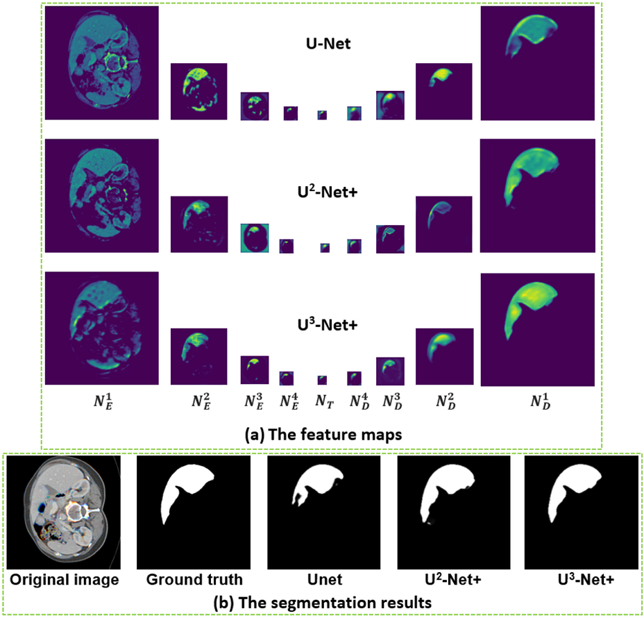

# Introduction into Diffusion & Latent Diffusion Models

# Introduction

In the last couple of years, large text-to-image models have become more and more powerful, achieving state-of-the-art results. These advancements have sparked interest in the domain and given birth to multiple commercial projects offering text-to-image generation on subscription or token-based models. Although used daily, their users rarely understand the way they work. So, in this article, I will explain the work of the Stable Diffusion model, one of the most popular text-to-image models to date.

As suggested by its name, Stable Diffusion is a type of diffusion model called a Latent Diffusion Model. It was first described in [**"High-Resolution Image Synthesis with Latent Diffusion Models"** by **Robin Rombach, Andreas Blattmann, Dominik Lorenz, Patrick Esser, and Björn Ommer**](https://arxiv.org/abs/2112.10752). At its core, there are two layers: the convolutional layer, which is responsible for image generation, and the self-attention layer, which is responsible for text processing.

# The convolutional layer

The purpose of the convolutional layer is to optimize the resources needed to process the images and extract the most information from those images. If we use a fully connected layer, then for a black and white figure of $n \times m$ pixels, we would need to have $n \times m$ inputs and $n \times m$ outputs, thus $n^2 \times m^2$ neural connection, which is excessive because in an image, the pixels that are closer to each other present more interest in extracting features that those far apart. In a convolution layer, a kernel, a two-dimensional grid of values, is used to compute the values of the output pixel by multiplying the surrounding pixels from the input to the corresponding value from the kernel and then adding the values together to get the value of the output. Kernel values can vary depending on the extracted features.

# U-Net and Computer Vision

Computer vision is a field of computer science that focuses on enabling computers to identify and understand objects and people in images and videos. One of the directions of computer vision is semantic segmentation, which is very important for analyzing bio-medical images. The problem with bio-medical images was that, often, there were not enough images to train a semantic segmentation model, which led to the research of better models that would train on fewer images. In 2015, **Olaf Ronneberger, Philipp Fischer, and Thomas Brox** published **"U-Net: Convolutional Networks for Biomedical Image Segmentation"**, introducing a new way of segmentation that required significantly less training data while outperforming older methods.

The **U-NET** architecture is composed of two “paths”. The first is the contraction path, also called the encoder. It works by saving the image as a three-dimensional tensor and then running $3 \times 3$ ReLu kernels to create different convolutions, starting from 3, then going to 64, to 128, to 256, to 512, and finally to 1024 channels. To get more information, after every two convolutional blocks, the image gets scaled down using a $2 \times 2$ max-pool before it goes into the following two convolutional blocks, thus widening the field of view of the kernels and capturing more context. While doing this, U-Net also saves the information each time the resolution is decreased. The second path is the symmetric expansion path, the decoder. It follows the opposite way to the first path by scaling the image back and gradually decreasing the number of channels. When reconstructing the image, the saved information from the corresponding resolution is added to the end of the channels and then incorporated. After merging all the channels and obtaining the final resolution, it returns the segmentation mask of the image. To train a U-Net we need a set of images and ground truths for each image, which is just the segmentation mask that we try to obtain. This set, then, is given to the U-Net to train on, for as many generations as needed until an accuracy threshold is reached.

# U-Net for denoising and diffussion

The U-Net performed so well at identifying things within an image that people started using it in other domains. One of the domains that uses it is denoising. To denoise an image with U-Net, first, we need to train it on images with various levels of noise, and the optimal way is on a set of images, with each image having multiple copies with increasing levels of noise and the noise used to create the series of images being used as the ground truth, upon which the network checks itself. Also, to make the U-Net understand the level of noise, the position in the noise series should be encoded in a value, and then embedded in a vector to make it more digestible for the network. This embedded position is later added at each point in the U-Net where the resolution is changed, to insert the information about how much noise is present as well as possible, such that the U-Net fully comprehends how much attention should be paid. To maintain the high quality of output images, the U-Net should not remove all the noise at once, but rather in small steps until a good image is obtained. The step usually corresponds with the noise step in the training data, which is also a reason it needs to train on different levels of noise.

If for example, the U-Net is trained on a similar set of data, but instead of a noisy image, it is fed a figure that contains pure noise, it will gradually denoise the image, but instead of increasing the quality of the initial image, it will create a new image similar to those in the training set, but in the same time unique, and this is what is called a diffusion model.

# Latent space and Latent Diffusion

Although U-Net needs a low amount of sample data to learn, it still needs a considerable amount of time to learn from and process new data, to improve those times, the diffusion is moved from a pixel space to a latent space. A latent space is a discretized method of representing information and it uses a special type of neural network, named auto-encoders to transform images from pixels to a set of features encoded in a tensor (n-dimensional vector) and then back from the tensor to the best approximation of the initial image. If for example, we have a $512 \times 512$ colored image (which is the default image size for Stable Diffusion), we will need $512 \times 512 \times 3$ space to represent it, and the model would need to analyze all of it, but when using an autoencoder the space is equal to $64 \times 64 \times 4$ which is 48 times decrease in space, thus a 48 times boost in performance. So the U-Net is not trained on images, but rather on latent representations of them, and latent noise is introduced to those images and, consequently, latent noise is used to generate new latent representations of images, that are, then, converted to pixel space and human comprehendible images. This is now considered a latent diffusion model.

# Conclusion

In conclusion, the exploration of Stable Diffusion and its underlying mechanisms underscores the profound strides made in bridging the gap between textual input and visual output within the domain of artificial intelligence. Through a meticulous examination of convolutional layers, U-Net architectures, latent diffusion models, and the integration of self-attention and Word2Vec embeddings, we have elucidated a sophisticated framework that enables the generation of images from textual descriptions. This journey has not only deepened our understanding of state-of-the-art text-to-image models but also highlighted the intricate interplay between neural networks, semantic understanding, and embedding techniques. As we reflect on the implications of Stable Diffusion, we recognize its transformative potential in various fields, from creative content generation to data synthesis and augmentation. Moving forward, continued research and refinement in this area hold the promise of unlocking new frontiers in AI-driven image synthesis, empowering individuals and industries alike with innovative tools for visual expression and communication.

# Sources:

1. <https://www.youtube.com/watch?v=sFztPP9qPRc>

2. <https://arxiv.org/abs/2112.10752>

3. <https://arxiv.org/abs/1505.04597>

4. <https://azure.microsoft.com/en-us/resources/cloud-computing-dictionary/what-is-computer-vision#object-classification>

5. <https://datascientest.com/en/u-net-computer-visions-neural-network#:~:text=One%20of%20the%20most%20widely,composed%20of%20two%20“paths”.>

6. <https://medium.com/swlh/fully-connected-vs-convolutional-neural-networks-813ca7bc6ee5>
7. <https://stable-diffusion-art.com/how-stable-diffusion-work/#:~:text=The%20latent%20space%20of%20Stable,latent%20space%20(latent%20noise).>

8. <https://www.tensorflow.org/text/tutorials/word2vec>

9. <https://www.researchgate.net/figure/The-architecture-of-the-latent-diffusion-model-LDM-that-is-considered-a-revolutionary_fig3_364442071>

10. <https://www.intel.com/content/www/us/en/developer/articles/technical/a-minimalist-deterministic-diffusion-model.html>
