# License Plate Number Detection (LPND)

In this article we will discuss systems for detecting vehicle license plates. We will explain several existing methods, their drawbacks, their advantages, and the contexts in which they are applied. This article provides the minimum information necessary to understand the topic. We will briefly touch on **License Plate Recognition (LPR)**, but we won’t delve deeply into it; instead, we’ll cover only the first stage of LPR, namely **LPND**. I am doing this because beginners entering this field might confuse these two concepts, and it’s best to start somewhere—so we’ll begin by studying **LPND**.

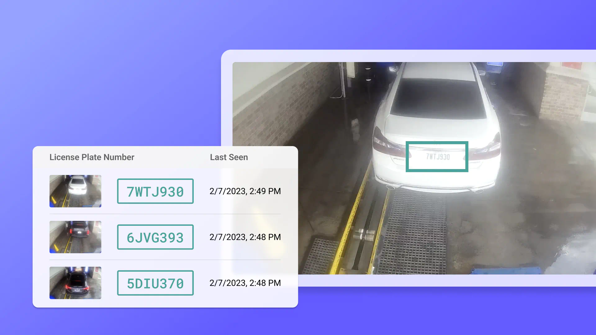

## Table of Contents <a id="content"></a>

1) [Introduction](#introduction)  
2) [Key Applications of LPR](#key-applications-of-lpr)  
3) [License Plate Recognition (LPR)](#lpr)  
   1. [Algorithm Structure](#lpr-structure)  
4) [License Plate Number Detection (LPND)](#lpnd)  
   1. [Object Contour Analysis](#object-contour-analysis)  
   2. [Segmented Boundary Analysis](#segmented-boundary-analysis)  
   3. [Histogram Analysis of Regions](#histogram-analysis-of-regions)  
   4. [Statistical Analysis, Classifiers](#statistical-analysis-classifiers)  
5) [Implementation LPND](#implementation-lpnd)  
   1. [Setting Up the Environment](#setting-up-the-environment)  
   2. [Importing Required Libraries](#importing-required-libraries)  
   3. [Reading Image and Applying Filters](#reading-image-and-applying-filters)  
   4. [Edge Detection](#edge-detection)  
   5. [Finding Contours](#finding-contours)  
   6. [Marking Number Plate](#marking-number-plate)  
   7. [Extract Number Plate](#extract-number-plate)  
7) [Advanced LPR Techniques](#advanced-lpr)  
8) [Conclusion](#conclusion)  
9) [References](#references)

---

## Introduction <a id="introduction"></a> [🔗](#content)

In general, **License Plate Number Detection (LPND)** is a component of **LPR**, and LPND consists of detecting the vehicle’s license plate—that is, determining its location and boundaries within an image. After that comes the second stage of **LPR**, which involves text recognition within the region identified in the previous step, handled by **Optical Character Recognition (OCR)**.

---

## Key Applications of LPR <a id="key-applications-of-lpr"></a> [🔗](#content)

1. **Traffic Management** → *LPR assists in monitoring vehicle flow, detecting traffic violations, and managing congestion by automating toll collection or lane prioritization. It also helps facilitate faster response times for emergency vehicles by identifying them in traffic.*  
2. **Law Enforcement** → *Police departments use LPR systems to track stolen vehicles, identify suspects, and flag vehicles with outstanding violations. These systems enable real-time monitoring and historical tracking of vehicle movements, which helps law enforcement build evidence for criminal cases.*  
3. **Parking Management and Access Control** → *LPR systems have transformed parking management, making it easier for vehicles to enter and exit paid parking lots without needing a physical ticket. This has become a common feature in schools, office buildings, residential areas, and critical infrastructure where vehicle access control is crucial. By identifying license plates, systems can automatically grant or deny access based on preset permissions.*

---

## LPR <a id="lpr"></a> [🔗](#content)

There are many solutions and diverse algorithms for detecting a vehicle’s license plate number, each with its own strengths and weaknesses. However, hardware is paramount: no matter how good an algorithm is, if the camera cannot capture high-quality footage that clearly shows the plates, or if the server lacks the processing power to handle incoming images in real time, the algorithm becomes irrelevant without high-quality input.

Here are two example images: one where the vehicle and its plate are crystal clear, and another where everything is in motion blur, making the plate invisible:

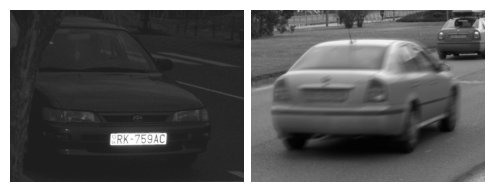  
*__Image:__ Two example images of vehicles—one high quality, one blurred.*

### Algorithm Structure <a id="lpr-structure"></a> [🔗](#lpr)

As mentioned above, there is the plate detection stage and the text recognition stage. But between these two steps, there is **Contrast Normalization**, a preprocessing technique used to enhance image clarity and the visibility of details.

1. **License Plate Number Detection** → _Detect the region containing the vehicle’s license plate._  
2. **License Plate Number Normalization** → _Identify the plate’s boundaries and normalize its contrast._  
3. **Optical Character Recognition** → _Extract the text from the normalized image._

---

## LPND <a id="lpnd"></a> [🔗](#content)

As previously mentioned, there are many methods available today for license plate detection. We will review a few of them and then perform a practical exercise in Python so that everyone can try this independently at home.

### Object Contour Analysis <a id="object-contour-analysis"></a> [🔗](#lpnd)

The first method that likely comes to mind is searching for rectangular contours. However, this method only works when there is a clear and distinct contour (but on vehicles, license plates can often be damaged, dirty, etc., especially in adverse weather), and nothing is obstructing them. Again, its success heavily depends on hardware quality and camera capabilities.

Below you can see examples illustrating the drawbacks and benefits of this approach:

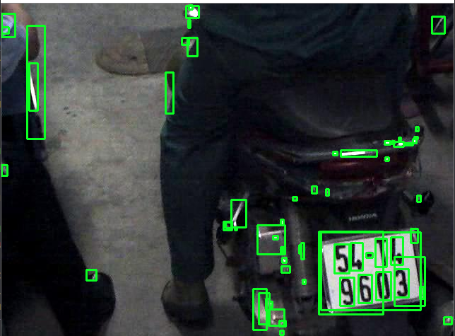  
*__Image:__ Example of object contour analysis on an unsuitable image.*

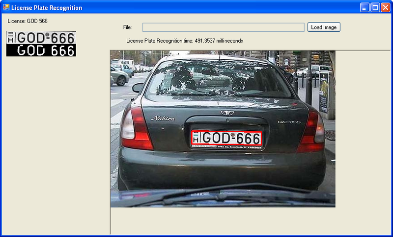  
*__Image:__ Example of object contour analysis on a suitable image.*

**To understand how this works:**  
1. *Perform image filtering to detect contours.*  
2. *Select and analyze those contours.*

This is not the most efficient method for such systems, but there may be cases where it is the best solution for you.

### Segmented Boundary Analysis <a id="segmented-boundary-analysis"></a> [🔗](#lpnd)

This approach is more complex but also more effective; it analyzes only the relevant parts of the plate. This method relies on selecting contours in the image, then searching for all vertical segments.

The hypothesis is that for any two vertical segments positioned close to each other, with only a slight offset along the y-axis, and with a distance relationship proportional to their length → the license plate number is located between them.

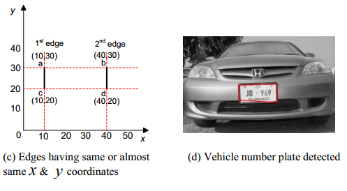  
*__Image:__ Geometric example of SBA and plate detection using this method.*

Finally, this method has its drawbacks. One is that if the plate is tilted, the vertical segments will not be detected, since this approach specifically looks for vertical lines. It is also sensitive to noise, such as bumper guards, decorations, uneven lighting, and so on.

### Histogram Analysis of Regions <a id="histogram-analysis-of-regions"></a> [🔗](#lpnd)

This method is based on the fact that the region containing the license plate exhibits a specific pixel intensity distribution ([histogram](https://en.wikipedia.org/wiki/Histogram)) distinct from the rest of the image.

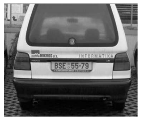  
*__Image:__ Example of a vehicle occupying almost the entire frame.*

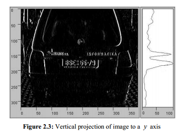  
*__Image:__ The previous image after applying the HAR method.*

**This method operates as follows:**  
1. **Frequency Feature Extraction** → _License plates contain text (clear/filled lines), which generates rapid intensity variations (high-frequency spatial components)._  
2. **Histogram Projection** → _Compute the vertical projection (along the Y-axis) of pixel intensities (summing pixel values across each horizontal line)._

Although popular, this method has its disadvantages: it depends on the vehicle’s size within the frame and will not work properly when the vehicle occupies only a quarter of the image. Background elements such as signs or advertisements can interfere. Moreover, it is sensitive to noise—shadows, dirty plates, or uneven lighting can degrade results.

### Statistical Analysis, Classifiers <a id="statistical-analysis-classifiers"></a> [🔗](#lpnd)

As noted in the previous sections, traditional methods struggle with dirty or dusty plates where boundaries are not well-defined. Below are a couple of examples:

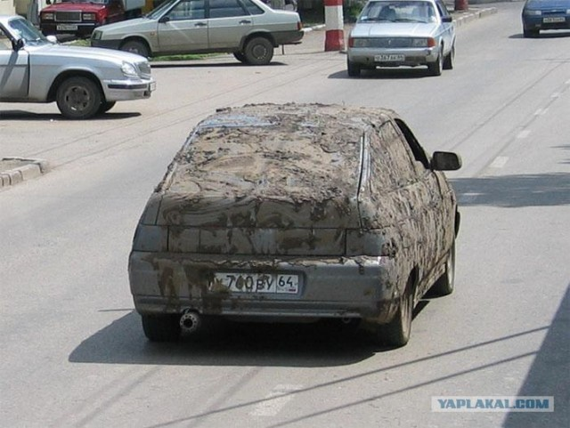  
*__Image:__ Example 1 of a vehicle with a dirty license plate.*

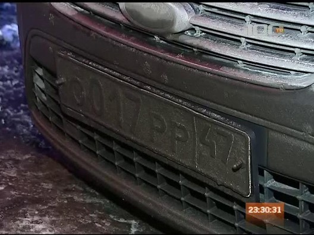  
*__Image:__ Example 2 of a vehicle with a dirty license plate.*

The best, albeit less commonly used, methods rely on various classifiers. For instance, a trained [Haar cascade](https://medium.com/analytics-vidhya/haar-cascades-explained-38210e57970d) works exceptionally well. Such methods analyze a region to check for characteristic features of license plates, such as specific aspect ratios, keypoints, or gradient patterns. Another interesting approach involves a specially designed transform.

These methods allow detection not only of standard plates but also of those in complex or atypical conditions.

**A notable weakness:**  
Many real-world algorithms depend directly or indirectly on the presence of plate edges. Even if edges are not used directly for detection, they can be important in subsequent analysis.

Surprisingly, for statistical algorithms, even a relatively clean plate mounted on a white car with a chrome frame can be a difficult case. This occurs because such situations are much rarer than dirty or worn plates and may not appear often enough in training data.

---

## Implementation LPND <a id="implementation-lpnd"></a> [🔗](#content)

In this chapter, we will not implement all the methods described earlier; we will focus solely on the first one, [Object Contour Analysis](#object-contour-analysis).  
> We will implement this method in Python, so if you do not have Python installed or have never worked with it before, I suggest you follow this [tutorial for installing and getting started with Python](https://www.w3schools.com/python/python_getstarted.asp).

We need an image where the car and its license plate are clearly visible. We will use this image:

  
*__Image:__ High-quality photograph of a car and its license plate.*

You can download it [here](https://www.pexels.com/ro-ro/fotografie/vedere-din-spate-a-volkswagen-golf-r-alb-pe-drum-deschis-31723208/).

### Setting Up the Environment <a id="setting-up-the-environment"></a> [🔗](#implementation-lpnd)

Before we begin, we need to install the dependencies required to implement OCA in Python. We need: **opencv-python**, **matplotlib**, **imutils**, and **numpy**.

1. **Creating a virtual environment**  
   Open your command line interface in the directory where you want to work and run:  
   ```cmd
   python -m venv venv
   ```  
   After creating the virtual environment, activate it with the following command on Windows:  
   ```cmd
   venv\Scripts\activate
   ```  
   On Linux:  
   ```bash
   source venv/bin/activate
   ```

2. **Installing requirements**  
   With the virtual environment activated, install all necessary libraries:  
   ```bash
   pip install opencv-python matplotlib imutils numpy
   ```

### Importing Required Libraries <a id="importing-required-libraries"></a> [🔗](#implementation-lpnd)

First, create a Python file (e.g., `main.py`), then import the required libraries:

```python
import os
import cv2
import numpy as np
import matplotlib.pyplot as plt
import imutils
```

### Reading Image and Applying Filters <a id="reading-image-and-applying-filters"></a> [🔗](#implementation-lpnd)

1. **Read the image**  
   ```python
   image_path = "image.jpg"  # Path to the image file
   image = cv2.imread(image_path)
   ```

2. **Convert from BGR to RGB**  
   OpenCV reads images in BGR format by default; we need RGB for display:  
   ```python
   image_rgb = cv2.cvtColor(image, cv2.COLOR_BGR2RGB)
   ```

3. **Apply a bilateral filter**  
   This filter reduces noise while preserving edges. First, convert to grayscale:  
   ```python
   gray = cv2.cvtColor(image, cv2.COLOR_BGR2GRAY)
   ```  
   Then apply the bilateral filter:  
   ```python
   bilateral_filter = cv2.bilateralFilter(gray, 11, 17, 17)
   ```

4. **Display the result**  
   Convert the filtered image back to RGB and show it using Matplotlib:  
   ```python
   # Convert the filtered image from BGR to RGB for display
   bilateral_filter_rgb = cv2.cvtColor(bilateral_filter, cv2.COLOR_BGR2RGB)

   plt.imshow(bilateral_filter_rgb)
   plt.title('Bilateral Filter')  # Set the plot title
   plt.show()  # Display the image
   ```
   **Output:**  
   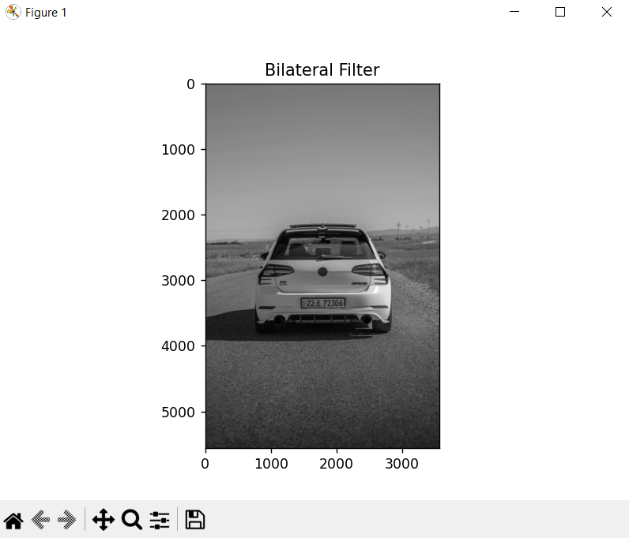

### Edge Detection <a id="edge-detection"></a> [🔗](#implementation-lpnd)

For this step, we will use the [Canny edge detection algorithm](https://www.geeksforgeeks.org/real-time-edge-detection-using-opencv-python/). It detects significant edges by smoothing the image to remove noise and then finding areas of rapid intensity change.

1. **Apply the Canny algorithm**  
   ```python
   image_edged = cv2.Canny(bilateral_filter, 30, 200)
   ```

2. **Display the result**  
   ```python
   image_edged_rgb = cv2.cvtColor(image_edged, cv2.COLOR_BGR2RGB)

   plt.imshow(image_edged_rgb)
   plt.title('Edge Detection')
   plt.show()
   ```
   **Output:**  
   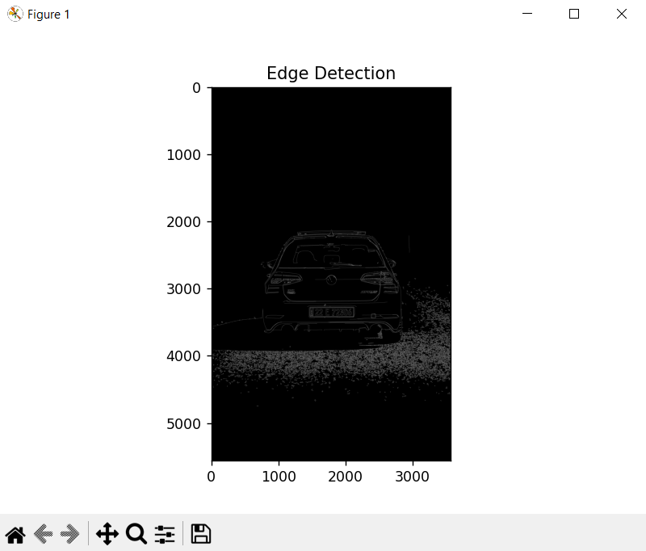

### Finding Contours <a id="finding-contours"></a> [🔗](#implementation-lpnd)

Contours are the boundaries of shapes with the same intensity in the image. They help identify objects or separate them from the background. The function `cv2.findContours()` detects these contours on binary images.

1. **Detect contours**  
   ```python
   keypoints = cv2.findContours(
       image_edged,
       cv2.RETR_TREE,
       cv2.CHAIN_APPROX_SIMPLE
   )
   ```

2. **Extract contours from keypoints**  
   ```python
   contours = imutils.grab_contours(keypoints)
   ```
   Sort the contours by area in descending order and select the top 10:
   ```python
   contours = sorted(contours, key=cv2.contourArea, reverse=True)[:10]
   ```

3. **Approximate to a rectangle**  
   Loop through the sorted contours and approximate each to a polygon with a 10-pixel tolerance. The function `cv2.approxPolyDP()` returns the approximated vertices:
   ```python
   location = None  # Will hold the plate location if detected
   for contour in contours:
       approx = cv2.approxPolyDP(contour, 10, True)
       if len(approx) == 4:
           location = approx
           break

   print(location)  # Print the detected location
   ```
   **Output:**  
   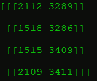

### Marking Number Plate <a id="marking-number-plate"></a> [🔗](#implementation-lpnd)

Once the license plate is located, we create a mask to isolate it from the rest of the image.

1. **Create an empty mask**  
   ```python
   mask = np.zeros(gray.shape, np.uint8)
   ```

2. **Draw the plate region in white on the mask**  
   ```python
   image_masked = cv2.drawContours(mask, [location], 0, 255, -1)
   ```

3. **Apply the mask**  
   ```python
   image_masked = cv2.bitwise_and(image, image, mask=mask)
   ```

4. **Display the masked image**  
   ```python
   image_masked_rgb = cv2.cvtColor(image_masked, cv2.COLOR_BGR2RGB)

   plt.imshow(image_masked_rgb)
   plt.title('Masked Image')
   plt.show()
   ```
   **Output:**  
   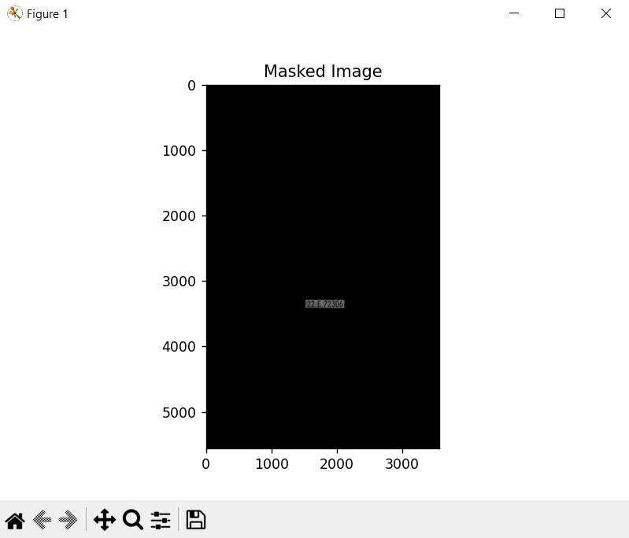

### Extract Number Plate <a id="extract-number-plate"></a> [🔗](#implementation-lpnd)

After isolating the plate, we crop the image to display only that region.

1. **Get the coordinates of the rectangle**  
   ```python
   x, y = np.where(mask == 255)  # Extract coordinates of white pixels in the mask
   x1, y1 = (np.min(x), np.min(y))  # Top-left corner
   x2, y2 = (np.max(x), np.max(y))  # Bottom-right corner
   ```

2. **Crop the plate from the image**  
   ```python
   image_cropped = gray[x1:x2+1, y1:y2+1]
   ```

3. **Display the cropped plate**  
   ```python
   image_cropped_rgb = cv2.cvtColor(image_cropped, cv2.COLOR_BGR2RGB)

   plt.imshow(image_cropped_rgb)
   plt.title('Cropped Image')
   plt.show()
   ```
   **Output:**  
   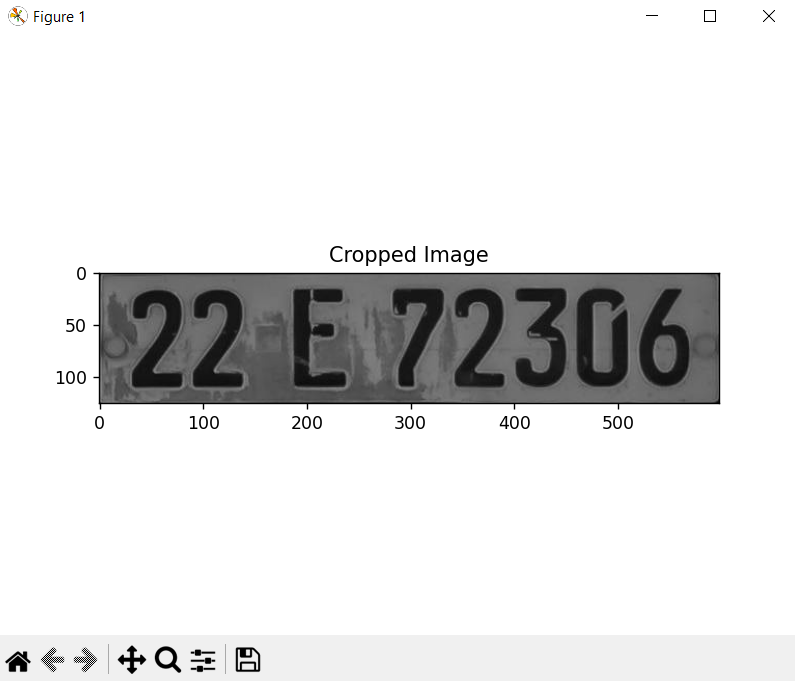

---

## Advanced LPR Techniques <a id="advanced-lpr"></a> [🔗](#content)

For those who wish to dive deeper into **LPND** or **LPR**, it is recommended to explore the following topics:

1. In-depth plate detection using pre-trained models (or training your own from scratch).  
2. Utilizing **Deep Learning** for improved detection.  
3. Further exploration of **License Plate Recognition**.  
4. Studying **OCR** to directly extract the license number from the plate.

---

## Conclusion <a id="conclusion"></a> [🔗](#content)

In conclusion, this article provided a general overview of **License Plate Recognition**, then explored four methods for **License Plate Number Detection**, implementing one of them in practice. We clarified the distinction between **LPR** and **LPND**. For a beginner starting out in this field, this article should be a useful introduction to the essential concepts, after which they can delve into the details of their chosen area of interest.

---

## References <a id="references"></a> [🔗](#content)

- [Licence Plate Recognition – what it is and how does it work?](https://publicsectornetwork.com/insight/licence-plate-recognition-what-it-is-and-how-it-works)  
- [Распознавание номеров: от А до 9](https://habr.com/ru/companies/recognitor/articles/221891/)  
- [Выделение границ](https://ru.wikipedia.org/wiki/%D0%92%D1%8B%D0%B4%D0%B5%D0%BB%D0%B5%D0%BD%D0%B8%D0%B5_%D0%B3%D1%80%D0%B0%D0%BD%D0%B8%D1%86)  
- [РАСПОЗНАВАНИЕ АВТОМОБИЛЬНЫХ НОМЕРОВ С ПОМОЩЬЮ PYTHON | КОМПЬЮТЕРНОЕ ЗРЕНИЕ | PYTESSERACT, OPENCV](https://www.youtube.com/watch?v=cPl0fnUTSrg&t=195s)  
- [Automatic Number Plate Recognition System using EasyOCR](https://www.geeksforgeeks.org/automatic-license-number-plate-recognition-system/)  
- [Гистограмма направленных градиентов](http://ru.wikipedia.org/wiki/%D0%93%D0%B8%D1%81%D1%82%D0%BE%D0%B3%D1%80%D0%B0%D0%BC%D0%BC%D0%B0_%D0%BD%D0%B0%D0%BF%D1%80%D0%B0%D0%B2%D0%BB%D0%B5%D0%BD%D0%BD%D1%8B%D1%85_%D0%B3%D1%80%D0%B0%D0%B4%D0%B8%D0%B5%D0%BD%D1%82%D0%BE%D0%B2)  
- [Real-Time Edge Detection using OpenCV in Python | Canny edge detection method](https://www.geeksforgeeks.org/real-time-edge-detection-using-opencv-python/)  
- [Python OpenCV – Find center of contour](https://www.geeksforgeeks.org/python-opencv-find-center-of-contour/)  
- [Обучение OpenCV каскада Хаара](https://habr.com/ru/articles/208092/)