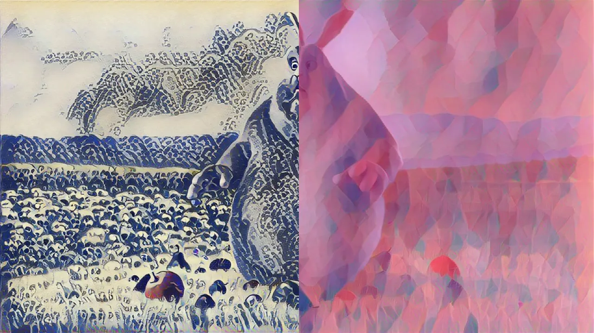
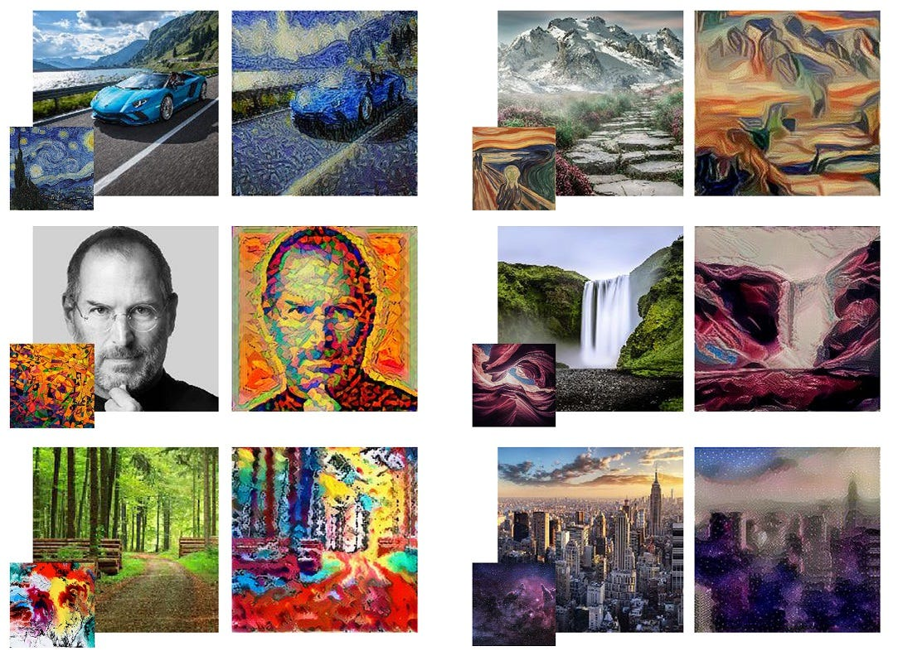

<h1>Neural Style Transfer: Creating Artistic Masterpieces with Deep Learning</h1>
<h2>Neural Style Transfer (NST) is a fascinating technique that allows you to combine the content of one image with the style of another to create visually stunning and artistically inspired images. It's a creative application of deep learning that has gained popularity for its ability to transform ordinary photos into masterpieces that resemble the style of famous artists like Vincent van Gogh or Pablo Picasso.</h2>

NST leverages the power of convolutional neural networks (CNNs) and their ability to understand and represent the content and style of images separately. In this article, we'll break down how NST works and then present a Python code implementation of this technique using PyTorch.

<h3>
NST works by defining two key images:
</h3>
Content Image: This is the source image whose content you want to preserve in the final output. For instance, if you use a picture of a cat as your content image, the final output will retain the structural details of the cat.

Style Image: This image provides the artistic style you want to apply to the content image. For example, if you use a painting by a famous artist as your style image, the output image will inherit the brushstrokes, colors, and overall artistic style of that painting.

The algorithm operates by iteratively optimizing a target image to minimize two key components of the loss function:

1. Content Loss:
This measures the difference between the content of the generated image and the content image. It encourages the generated image to have similar high-level features and structures as the content image.

2. Style Loss:
The style loss quantifies the difference in style between the generated image and the style image. It's calculated by comparing the Gram matrices of feature maps at multiple layers in the neural network. The Gram matrix encodes statistical information about the style, including texture and color.

By minimizing these two losses simultaneously, the algorithm transforms the content image into something that closely resembles the content of the content image and the artistic style of the style image.

Now, let's dive into the Python code that implements this exciting technique.

<h3>Neural Style Transfer Code</h3>
We'll break down the code into snippets, explaining each part's functionality.

<h4>1. Environment Setup</h4>

    import torch
    import torch.nn as nn
    import torch.optim as optim
    import torchvision.models as models
    import torchvision.transforms as transforms
    from PIL import Image
    import numpy as np
We import the necessary libraries, including PyTorch and torchvision for deep learning functionality, and the Python Imaging Library (PIL) for image processing.

<h4>2. Device Selection and Image Loading</h4>

    device = torch.device('cuda' if torch.cuda.is_available() else 'cpu')
    
    def load_image(image_path, transform=None, max_size=None):
        image = Image.open(image_path)
    
        if max_size:
            # Resize the image while maintaining its aspect ratio
            width, height = image.size
            if width > height:
                new_width = max_size
                new_height = int(height * (max_size / width))
            else:
                new_width = int(width * (max_size / height))
                new_height = max_size
    
            image = image.resize((new_width, new_height), Image.LANCZOS)
    
        if transform:
            image = transform(image).unsqueeze(0)
    
        return image.to(device)
Here, we set the device to GPU if available, load an image, and apply optional resizing and transformation operations.

<h4>3. VGGNet for Feature Extraction</h4>

    class VGGNet(nn.Module):
        def __init__(self):
            super(VGGNet, self).__init__()
            self.select = ['0', '5', '10', '19', '28']
            self.vgg = models.vgg19(pretrained=True).features
    
        def forward(self, x):
            features = []
            for name, layer in self.vgg._modules.items():
                x = layer(x)
                if name in self.select:
                    features.append(x)
            return features
We define a VGGNet class to extract features from our images using a pre-trained VGG-19 network.

<h4>4. Main NST Function</h4>

    def main(content_path, style_path, max_size=400, total_step=4000, log_step=80, sample_step=800, style_weight=100, lr=0.001):
        transform = transforms.Compose([
            transforms.ToTensor(),
            transforms.Normalize(mean=(0.472, 0.436, 0.424), std=(0.227, 0.226, 0.225))
        ])
    
        content = load_image(content_path, transform, max_size=256)
        style = load_image(style_path, transform, max_size=256)  # Resize style image to match content dimensions
    
        target = content.clone().requires_grad_(True)
    
        optimizer = torch.optim.Adam([target], lr=lr, betas=[0.5, 0.999])
        vgg = VGGNet().to(device).eval()
    
        for step in range(total_step):
            # ... (continues in the next snippet)
In this part, we set up the main function that performs the NST. We define transformation operations, load content and style images, and create a target image to optimize. We also set up the optimizer and VGGNet for feature extraction.

<h4>5. NST Iterations and Loss Calculation</h4>

        target_features = vgg(target)
        content_features = vgg(content)
        style_features = vgg(style)

        style_loss = 0
        content_loss = 0
        for f1, f2, f3 in zip(target_features, content_features, style_features):
            content_loss += torch.mean((f1 - f2) ** 2)

            # Check dimensions of f1 and f3
            _, c, h, w = f1.size()
            f1 = f1.view(c, -1)  # Reshape f1 to (c, h*w)
            f3 = f3.view(c, -1)  # Reshape f3 to (c, h*w)

            # Calculate Gram matrix for f1 and f3
            f1 = torch.mm(f1, f1.t())
            f3 = torch.mm(f3, f3.t())

            style_loss += torch.mean((f1 - f3) ** 2) / (c * h * w)
Here, we calculate the content and style losses by comparing features extracted from the content, style, and target images.

<h4>6. Backpropagation and Optimization</h4>

        loss = content_loss + style_weight * style_loss
        optimizer.zero_grad()
        loss.backward()
        optimizer.step()

        if (step+1) % log_step == 0:
            print('Step [{}/{}], Content Loss: {:.4f}, Style Loss: {:.4f}'.format(step+1, total_step, content_loss.item(), style_loss.item()))

        if (step+1) % sample_step == 0:
            # ... (continues in the next snippet)
We optimize the target image by backpropagating the loss and updating it with the Adam optimizer. Optionally, we log the loss values and save intermediate results.

<h4>7. Image Post-Processing and Saving</h4>

            denorm = transforms.Normalize((-2.12, -2.04, -1.80), (4.37, 4.46, 4.44))
            img = target.clone().squeeze()
            img = denorm(img).clamp_(0, 1)
            img = img.cpu().detach().numpy()
            img = np.transpose(img, (1, 2, 0))
            img = (img * 255).astype(np.uint8)
            img = Image.fromarray(img)
            img.save('output-{}.png'.format(step+1))
Finally, we denormalize, convert, and save the generated image as an artistic masterpiece.

Neural Style Transfer (NST) is a captivating fusion of art and artificial intelligence. It allows you to explore your artistic potential and create mesmerizing images that blend the content of one image with the style of another. By understanding and implementing NST, you can embark on a creative journey like no other.

The code snippets we've presented here offer a foundation for your NST experiments. With your content and style images, you can transform ordinary photos into extraordinary visual expressions. Whether you're passionate about art or simply curious about the possibilities of AI, NST is a gateway to boundless creativity.

We encourage you to try NST for yourself. Experiment with various content and style combinations, tweak hyperparameters, and witness the magic unfold. Create artworks that merge your favorite photos with iconic artistic styles. Share your creations with the world and be amazed by the beauty you can unleash.

NST is not just about creating art; it's about pushing the boundaries of what AI can achieve. It's a testament to the synergy between technology and human imagination. So, don't hesitate to dive in, explore, and craft your own artistic masterpieces. The world of neural style transfer awaits, and it's yours to shape and share. Let your creativity flow and turn your vision into reality through the power of deep learning and art.

