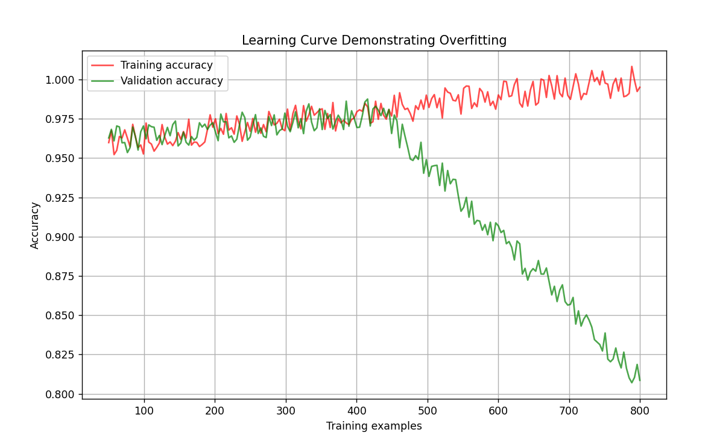

    

# How to Mitigate Overfitting and Underfitting in Classification Models: Strategies and Techniques

In the dynamic landscape of machine learning, the quest for building accurate classification models often encounters formidable obstacles in the forms of overfitting and underfitting. These twin adversaries represent pivotal challenges, where overfitting inundates models with noise and irrelevant patterns, while underfitting renders them too simplistic to discern essential data patterns.

In this comprehensive exploration, we embark on a journey through the strategies and techniques designed to combat overfitting and underfitting. From fundamental methodologies such as cross-validation and regularization to sophisticated approaches like ensemble learning and feature engineering, we delve deep into the arsenal of tools available to empower practitioners in constructing robust classification models.
Through a blend of theoretical understanding and practical implementation, this article endeavors to arm readers with the knowledge and insights needed to navigate the intricacies of overfitting and underfitting. By elucidating these concepts and demonstrating their application in real-world scenarios, we aim to catalyze the development of more resilient and dependable machine learning solutions.

## Overfitting

In the realm of classification models, overfitting manifests when a model becomes excessively complex, capturing noise and irrelevant fluctuations in the training data. This complexity often arises in models with numerous parameters or high degrees of freedom, such as decision trees with deep branches or support vector machines with complex kernel functions. As a result, the model learns to distinguish not only genuine patterns but also idiosyncrasies specific to the training data, hindering its ability to generalize to unseen instances. Moreover, overfitting in classification models can be exacerbated by the presence of redundant features or insufficient regularization techniques. Failure to address these issues may lead to inflated performance metrics on the training set while diminishing performance on validation or test data, thereby compromising the model's effectiveness in practical applications.

## Underfitting

Conversely, underfitting in classification models arises when the model fails to capture the underlying patterns present in the data adequately. This deficiency often stems from the use of overly simplistic models or inadequate model training. For instance, employing linear classifiers in scenarios with nonlinear decision boundaries may result in underfitting, leading to suboptimal classification performance. Furthermore, underfitting can be exacerbated by factors such as feature scaling, imbalanced class distributions, or insufficient model complexity. In such cases, the model may struggle to discern meaningful patterns, resulting in poor predictive accuracy across both training and validation datasets. Addressing underfitting requires careful consideration of model selection, feature engineering, and optimization techniques to ensure that the model can effectively capture the complexity of the classification task while avoiding unnecessary bias or simplification.Conversely, underfitting in classification models arises when the model fails to capture the underlying patterns present in the data adequately. This deficiency often stems from the use of overly simplistic models or inadequate model training. For instance, employing linear classifiers in scenarios with nonlinear decision boundaries may result in underfitting, leading to suboptimal classification performance. Furthermore, underfitting can be exacerbated by factors such as feature scaling, imbalanced class distributions, or insufficient model complexity. In such cases, the model may struggle to discern meaningful patterns, resulting in poor predictive accuracy across both training and validation datasets. Addressing underfitting requires careful consideration of model selection, feature engineering, and optimization techniques to ensure that the model can effectively capture the complexity of the classification task while avoiding unnecessary bias or simplification.

## Learning-Curve
Learning curves are essential in understanding how well a model is learning from its training process. These curves plot the model's accuracy or error on both the training set and a separate validation set as training progresses. Such curves allow us to diagnose overfitting, where the model performs increasingly well on the training data but poorly on unseen data, suggesting it is learning the specifics of the training set rather than the underlying pattern. In contrast, underfitting is indicated by a learning curve where the model performs poorly on both sets, implying it is too simplistic and has not learned the relevant patterns in the data at all. Through learning curves, we can gauge if additional data or a model complexity adjustment is required to improve learning.

    

This graph displays a classic sign of an overfitting model in machine learning. The training score is consistently high across the number of training examples. This suggests that the model has likely memorized the training data, rather than learning the underlying patterns.The cross-validation score is significantly lower than the training score and does not improve with more training examples. This indicates that the model is not generalizing well to unseen data.

    

 In this graph the training accuracy remains consistently high as the number of training examples increases. This indicates that the model is performing well on the training data throughout the learning process.The validation accuracy starts off comparable to the training accuracy but then significantly deteriorates as the number of training examples grows. This divergence suggests that while the model is learning the training data very well, its performance on unseen data (validation data) is worsening.The reason this pattern indicates overfitting is that an ideal model should not only fit the training data well but also generalize to new data. The large gap between the training and validation lines, with validation accuracy decreasing, is a clear sign that the model is fitting to noise or specific patterns in the training data that do not apply to the broader dataset. In other words, the model is learning the training data too well, including its anomalies and random fluctuations, which do not represent real-world patterns.

    

Here is a graph illustrating the learning curve of an underfitted model. In this graph, both the training accuracy and validation accuracy are low, with a slight improvement as the training size increases. The fact that both accuracies are quite close to each other and low indicates that the model is not capturing the underlying trend in the data well, which is characteristic of underfitting. The model may be too simple and unable to capture the complexity of the dataset. ​

    

In this graph, the learning curve for an underfitted model shows a different pattern with some increases and decreases in accuracy. Both the training accuracy and the validation accuracy show fluctuations, and a general upward trend initially, but then the validation accuracy dramatically decreases after a certain point. This could suggest overfitting past that point, or it could represent high variance in the data. However, since both accuracies remain relatively low overall, the model likely suffers from underfitting, as it doesn't capture the underlying data distribution well. ​​

    

Here’s the learning curve for a good fit model. There’s a notable initial gap between training and validation accuracy, representing potential learning and adaptation to the training data. The gap diminishes as the training size increases, showing that the model is generalizing better with more data. The validation accuracy closely follows the training accuracy towards the end, which is a sign of a model that generalizes well and is not overfitting or underfitting.

## How to deal with overfitting?
### Regularization Techniques:
In machine learning, regularization is a strategy that reduces overfitting and enhances a model's capacity for generalization. During the training phase, a penalty term is added to the loss function to assist regulate the model's complexity. Regularization prevents the model from fitting noise and random oscillations in the training data by imposing this penalty. Finding the ideal balance between preventing overfitting and providing a good fit for the training set is the aim of regularization. It steers clear of undue complexity and pushes the model to capture the underlying patterns in the data.

Regularization Techniques:

1- L1 regularization (Lasso)

    from sklearn.linear_model import LogisticRegression

    # Logistic regression with L1 regularization
    lasso_classifier = LogisticRegression(penalty='l1', solver='saga', max_iter=1000)
    lasso_classifier.fit(X, y)  

2- L2 regularization (Ridge).

    from sklearn.linear_model import RidgeClassifier

    # Ridge classifier with L2 regularization
    ridge_classifier = RidgeClassifier(alpha=1.0)
    ridge_classifier.fit(X, y)

3- Elatic Net

    from sklearn.linear_model import ElasticNet
    from sklearn.datasets import make_regression

    # Elastic Net regularization
    X, y = make_regression(n_features=2, random_state=0)
    elastic_net = ElasticNet(random_state=0, alpha=1.0, l1_ratio=0.5)
    elastic_net.fit(X, y)

    

### Feature Selection:
Feature selection is about identifying the most relevant features for use in model construction. The goal is to improve model performance by eliminating unnecessary features which can lead to reduced complexity, improved accuracy, and reduced overfitting.

1- Be cautious of a feature with excessively high importance in your model—it could overshadow other valuable predictors and lead to overfitting. Such dominance suggests the model may simply memorize patterns associated with this feature rather than learning to generalize. Consider removing or adjusting this feature to ensure your model benefits from the full range of data and better captures the underlying patterns.

    from pandas import DataFrame as df
    import matplotlib.pyplot as plt

    from sklearn.ensemble import RandomForestClassifier
    feature_importances = df(clf_forest.feature_importances_, index=X.columns, columns=['importance']).sort_values('importance', ascending=False)
    feture_importances = feature_importances.head(10)

    # Plot the feature importances
    feture_importances.plot(kind='barh')
    plt.title('Feature Importances')

An example of a feature with a too high correlation:

    

2- One effective feature selection method is correlation feature selection. Correlation measures how closely the distributions of two numerical series are related. There are several types of correlation, with Pearson, Spearman, and Kendall being the most commonly used. Each has a different approach to measuring the association between variables, with Pearson correlation focusing on linear relationships, Spearman on rank-order, and Kendall on concordance. The Pearson Correlation selection is implemented in kydavra python library as PearsonCorrelationSelector (Kendall as KendallCorrelationSelector and Spearman as SpearmanCorrelationSelector) and as all correlation based selectors can be used as follows.

Install kydavra library:

    pip install kydavra

The code snipet for Pearson correlation selection:

    from kydavra import PearsonCorrelationSelector
    pearson = PearsonCorrelationSelector()
    selected_columns = pearson.select(df, ’target’)

### Collect More Data or Class Balancing: 
Collecting more data is often the best way to improve model performance as it can expose the model to a greater variety of the underlying data distribution. Oversampling the Minority Class or Undersampling the Majority Class involves replicating examples in the minority class and reduces the number of examples in the majority class to match the minority class respectively.This can be done until the minority and majority classes are balanced. Undersampling the Majority Class can be helpful when you have a vast amount of data and don't want to increase the size further.

1- The Synthetic Minority Over-sampling Technique (SMOTE) creates synthetic samples that are a combination of the nearest neighbors of minority class samples. This technique can generate a balanced dataset without repeating minority class samples. One of the main drawbacks of SMOTE is that local outliers may influence it. SMOTEENN is solving the problem of outliers using the EEN algorithm. Before applying a Balancer to a dataset, you should first split it into a train and test set. We will balance only the train set, fit the model on it, and test using different metrics on the test set.

Install crucio library:

    pip install crucio

The code snipet for SMOTEENN:

    from crucio import SMOTEENN
    smoteenn = SMOTEENN()
    balanced_df = smoteenn.balance(df, ’target-column’)

### Cross-Validation: 
Cross-validation is a resampling procedure used to evaluate machine learning models on a limited data sample. The primary goal of cross-validation is to define a dataset to test the model in the training phase to limit problems like overfitting, and give an insight on how the model will generalize to an independent dataset.

1- K-Fold Cross-Validation is especially common: it splits the data into K equal parts (or "folds"), then uses one fold to validate the model and the remaining K-1 folds for training. This process is repeated K times, with each fold used exactly once as the validation data. The results are then averaged (or otherwise combined) to produce a single estimation. Cross-validation is employed to obtain a dependable performance estimate for unseen data, to verify consistency across the model to counteract overfitting, and to maximize the utility of a limited dataset for thorough testing. This cross-validation object is a variation of KFold that returns stratified folds. The folds are made by preserving the percentage of samples for each class.

The code snippet for Stratified-K-Fold Cross-Validation:

    from sklearn.model_selection import cross_val_score, StratifiedKFold
    from sklearn.ensemble import RandomForestClassifier
    from sklearn.datasets import make_classification

    # Generate a binary classification dataset
    X, y = make_classification(n_samples=1000, n_features=20, n_informative=2, 
                            n_redundant=10, random_state=42)

    # Initialize the classifier
    clf = RandomForestClassifier(n_estimators=100, random_state=42)

    # Define the k-fold cross-validator
    kfold = StratifiedKFold(n_splits=5, shuffle=True, random_state=42)

    # Perform K-fold cross-validation
    cv_scores = cross_val_score(clf, X, y, cv=kfold, scoring='accuracy')

    print(f'CV scores for each fold: {cv_scores}')
    print(f'CV average score: {cv_scores.mean()}')

### Other tips for overfitting:
1) Use ensemble techniques such as bagging and boosting to combat overfitting. For instance, Random Forest combines multiple decision trees to enhance accuracy and mitigate overfitting by averaging predictions. Boosting algorithms like AdaBoost, Gradient Boosting, and XGBoost sequentially improve model performance, reducing both bias and variance.
2) In decision trees, pruning can remove the branches that have little power in classifying instances, which can reduce overfitting. It can reduce the size and complexity of the tree, and improve its generalization and interpretation. Pruning can be applied either before or after the tree is fully grown, using different methods and criteria.
3) Hyperparameter Tuning like grid search, random search, or Bayesian optimization to find the optimal set of hyperparameters that minimize overfitting.
4) Utilize class-weights to adjust the penalty for misclassifying minority class samples. By default, each classification error carries equal weight, but assigning different weights to misclassification cases can address this imbalance. Adjusting class-weights allows for a more nuanced approach in handling classification errors, particularly for imbalanced datasets.

## How to deal with underfitting?
### Increasing Model Complexity:
Addressing underfitting often requires providing the model with the tools to discern more complex patterns and relationships within the dataset. Transition to a more sophisticated model structure that is capable of detecting a broader assortment of patterns. If your initial approach was, for example, a simple linear regression, you might move to a polynomial regression, which can capture non-linear relationships between variables.

    from sklearn.preprocessing import PolynomialFeatures
    from sklearn.linear_model import LinearRegression
    from sklearn.pipeline import make_pipeline

    # Sample code to create a polynomial regression model
    degree = 7  # The degree of the polynomial features
    polyreg = make_pipeline(PolynomialFeatures(degree), LinearRegression())

    # Fit the model to the data
    polyreg.fit(X_train, y_train)

    

### Feature Engineering:
Enhancing model performance can often be achieved through thoughtful feature engineering. This encompasses both the introduction of new, predictive features and the refinement of existing ones.

Introducing new features involves identifying additional relevant information that could improve the model’s understanding and prediction capabilities. This could mean including data from external sources, deriving new metrics from the existing data, or uncovering hidden insights through domain knowledge.
Example:
Imagine we have a dataset for predicting customer churn, and it includes features like total_purchase_amount and number_of_purchases. We might introduce a new feature, average_purchase_amount, to provide more insights into customer behavior.

    import pandas as pd

    # Now, df includes a new feature that may help improve model predictions
    df['average_purchase_amount'] = df['total_purchase_amount'] / df['number_of_purchases']

Continuing with the customer churn prediction theme, let’s say our dataset includes the features age and years_as_customer. We might hypothesize that older customers who have been with the company longer are less likely to churn. Thus, we could create a combined feature reflecting this interaction.

    # The new 'customer_loyalty_score' could offer a more nuanced signal for the model.
    df['customer_loyalty_score'] = df['age'] * df['years_as_customer']

    # Optionally, apply a transformation to normalize the distribution if necessary
    df['customer_loyalty_score'] = np.log1p(df['customer_loyalty_score'])

### Decreasing Regularization:
Regularization techniques like L1 (Lasso) and L2 (Ridge) regularization are commonly used in supervised learning models to prevent overfitting by penalizing large weights. While these techniques can help make models more generalizable, overly strong regularization might lead to underfitting, where the model cannot capture the underlying patterns in the data well enough. Reducing the regularization strength can allow the model more flexibility to learn from the data, potentially improving its performance, especially when facing underfitting issues.

Decreasing L2 Regularization in Logistic Regression:

    from sklearn.linear_model import LogisticRegression

    # Logistic regression with decreased L2 regularization
    logreg_low_reg = LogisticRegression(C=1.5, penalty='l2')  # Increasing C decreases regularization strength
    logreg_low_reg.fit(X_train, y_train)
    print("Low Regularization Score:", logreg_low_reg.score(X_test, y_test))

### Other tips for underfitting:
1) Sometimes, the chosen algorithm might not be well-suited for the data or the problem. Trying different algorithms might yield better results.
2) Use cross-validation to ensure that the model is not being assessed on too limited a portion of the data. An example of it is provided earlier in this article.
3) If the model is underfitting due to a lack of training data, one can try collecting more data or using data augmentation techniques to artificially increase the size of the training set.

## Conclusion
The struggle with overfitting and underfitting in machine learning is like searching for the perfect middle ground, where our models get data analysis just right. We aim to create models that are not too complicated or too simple but just right for what they need to do. This article has walked us through ways to fine-tune our machine learning models, highlighting tools like regularization, feature engineering, cross-validation, and learning curves.

In the specific area of classification models, where we’re often trying to sort things into categories or predict which category something belongs to, keeping a balance is key. Whether we’re figuring out fraud, grouping customers, or understanding feelings in text, the approaches we’ve discussed are crucial. They help us make classification models that are accurate, strong, and flexible, ready to take on real-world challenges.
