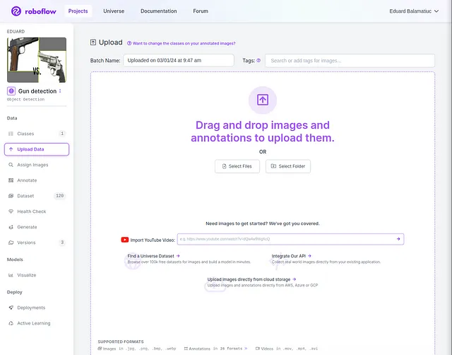

# The new Object Detection model YOLOv9 in action: A Swift Guide to Training on Your Data

## Updates on the new YOLOv9 model

For those who don’t know, there is a new member in the YOLO family of models. In February of 2024 a new paper titled “YOLOv9: Learning What You Want to Learn Using Programmable Gradient Information” was released, you can find the entire content here if you want to get into more depth, but here is a quick overview:

*The core of the solution is the introduction of Programmable Gradient Information (PGI) and a new lightweight network architecture known as Generalized Efficient Layer Aggregation Network (GELAN).*

**Programmable Gradient Information (PGI)***: The paper introduces **PGI** as a method to mitigate the loss of information as data passes through the layers of deep neural networks. **PGI** ensures that complete input information is available for the target task to calculate the objective function, allowing reliable gradient information to be obtained for network weight updates.*

**Generalized Efficient Layer Aggregation Network (GELAN): GELAN** *is designed based on gradient path planning and aims to optimize parameter utilization. This architecture demonstrates superior results in lightweight models, particularly when combined with **PGI**, showing better performance in object detection tasks on the MS COCO dataset compared to existing state-of-the-art methods.*

**Superior Performance***: The combination of **GELAN** and **PGI** on MS COCO dataset-based object detection has shown to outperform other methods, particularly in terms of parameter utilization and accuracy, even surpassing models pre-trained on large datasets.*


## Hands-on interaction with the new YOLOv9

All theory is great but let’s get to the real stuff already. In this section, I will show you how to utilize the new model on your Custom Dataset using **Roboflow** based on the following notebook. Here are the steps:

### Make sure that your runtime type is set to GPU:
You can check that by selecting Runtime > Change runtime type, and make sure that the GPU option is selected.


Now run the following parts to confirm that we are using the right machine type and to make it easier to utilize our dataset.

```python
!nvidia-smi
import os
HOME = os.getcwd()
print(HOME)
```

### Setup and installations

The time has come to clone the YOLOv9 repo, and install the roboflow library so that we can easily download our dataset directly in the notebook, and download the model weights.

```python
!git clone https://github.com/SkalskiP/yolov9.git
%cd yolov9
!pip install -r requirements.txt -q
!pip install -q roboflow
!wget -P {HOME}/weights -q https://github.com/WongKinYiu/yolov9/releases/download/v0.1/yolov9-c.pt
!wget -P {HOME}/weights -q https://github.com/WongKinYiu/yolov9/releases/download/v0.1/yolov9-e.pt
!wget -P {HOME}/weights -q https://github.com/WongKinYiu/yolov9/releases/download/v0.1/gelan-c.pt
!wget -P {HOME}/weights -q https://github.com/WongKinYiu/yolov9/releases/download/v0.1/gelan-e.pt
!ls -la {HOME}/weights
```
*Further in the notebook, you can try the pre-trained models on some example data and see how they behave, but since the goal of this article is custom data we will skip this part and go straight into that part!*

### Create your Roboflow Dataset
The next step is creating the custom dataset that you would like to work with.

*Just as a mention, is not mandatory to use roboflow, as long as the file structure of the train and test data corresponds to the YOLOv9 file structure criteria you could do it manually as well on your computer. I encourage enthusiastic readers to do that but for this article, we will continue using Roboflow since it offers an easier interaction.*

Go to the Roboflow *Projects* page and select **Create New Project.**


Then you will be redirected to the Creation page, make sure to fill in all the details that are requested, here is an example:


From this point on, I will use one of my projects that I already created before, but every detail should be the same on your side. You will be asked to upload the data of your dataset, so make sure you add all the relevant images there and click **Upload**.



Next, you will have to annotate your images. It’s quite straightforward:

**You select the image.**


**Using the tooltip you create the box around the correct object.**


**Then you assign the corresponding class to the selected box.**


The next step is the generation phase, you have to create a version, here make sure to configure all the preprocessing and augmentation steps that you feel are relevant to your specific case, and go further.

*I will not go into too much depth about the options but feel free to click around and to from different version of your dataset!*

Once you’re done with selecting your options click **Create.**


Great! Now you have a dataset version to utilize, here is how it looks:


Now select the **Export Dataset** option in the upper right corner, check the *show download code* option and the *YOLOv9* format, then press continue.


You will be provided a download code, copy it, and paste it into the following section from the notebook:


*As a mention, make sure that you don’t share the code from there with others, it’s based on your personal account, and there might be some security issues because of it.*

After running the above cell you should have all the data in the notebook session. Great job so far!

### Let’s train hard

Finally, now we need to train our custom model, set up your parameters based on your project needs, and change the batch size, number of epochs, and image resolution sizes accordingly:

```python
%cd {HOME}/yolov9

!python train.py \
--batch 16 --epochs 25 --img 640 --device 0 --min-items 0 --close-mosaic 15 \
--data {dataset.location}/data.yaml \
--weights {HOME}/weights/gelan-c.pt \
--cfg models/detect/gelan-c.yaml \
--hyp hyp.scratch-high.yaml
```

The training process might take some time depending on the size of your dataset and the parameter configuration that you chose. So in the meantime, you can enjoy some coffee.

### Check this out, we got results!
To look at how our model did during the training part here is the code snippet to plot a cool metrics graph. I will showcase my results and metrics but don’t expect them to be great since my dataset was quite small and poor, the goal was just to showcase the possibility of training the new model so if you provide a good dataset you shouldn’t have any issue.

```python
from IPython.display import Image

Image(filename=f"{HOME}/yolov9/runs/train/exp/results.png", width=1000)
```


And how can we go without a confusion matrix?

```python
from IPython.display import Image

Image(filename=f"{HOME}/yolov9/runs/train/exp/confusion_matrix.png", width=1000)
```


If you want to check out the predictions of the model, you can do that this way:

```python
from IPython.display import Image

Image(filename=f"{HOME}/yolov9/runs/train/exp/val_batch0_pred.jpg", width=1000)
```

## This was it!
That’s how you train the new YOLOv9 Model. This article was inspired by the YOLOv9 paper in combination with the custom training colab notebook developed by the guys from Roboflow.

Let’s connect on LinkedIn:

Eduard Balamatiuc | LinkedIn

Made with ❤ by Sigmoid.

Follow us on Facebook, Instagram, and LinkedIn:

https://www.facebook.com/sigmoidAI

https://www.instagram.com/sigmo.ai/

https://www.linkedin.com/company/sigmoid/